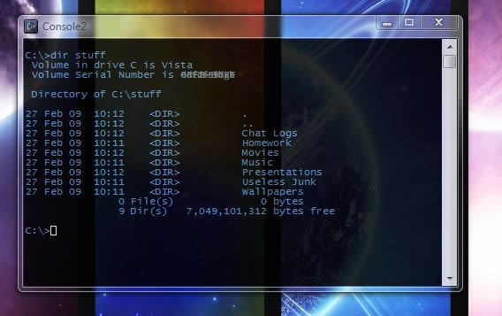
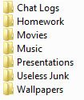
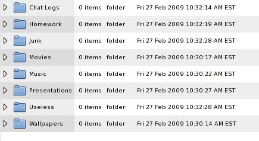
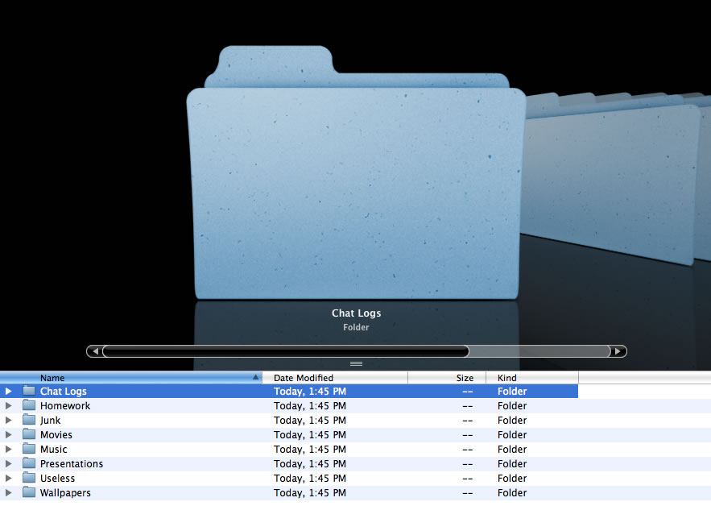
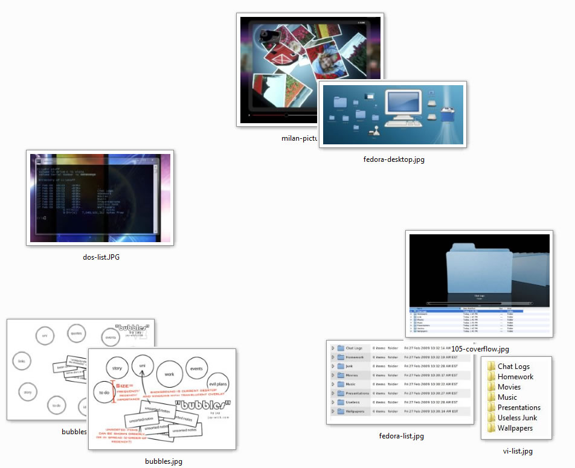
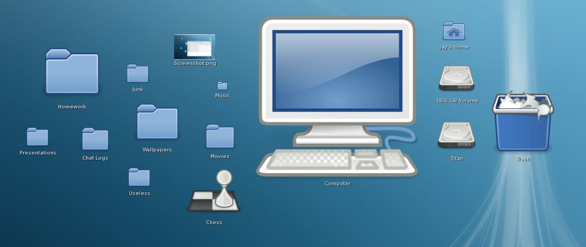
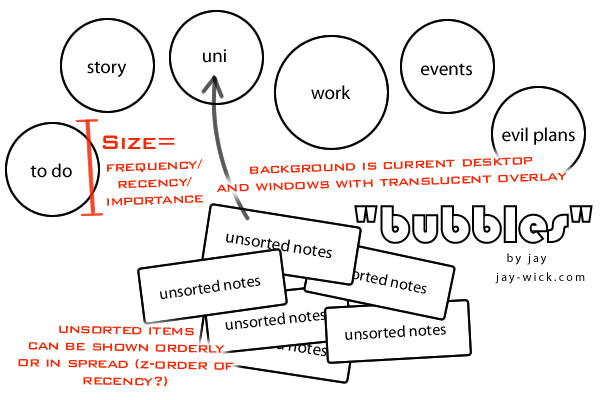

I was recently showing a co-worker the Microsoft Surface parody when inspiration slapped me in the face. I loved the way photos sprung out of the camera when placed on the screen. But it's awesomeness for me wasn't just how cool it looked, but the fact it changed my view of file management forever.

Files to this day are stored in a linear fashion, that is to say, they are restricted to one dimension. Go to your local Documents folder and view the contents as a list.

---

## The dinosaur that is the first dimension

The reason we have this ancient linear mind frame goes all thanks to the days of command lines.

A list of files shown in 1D. And now if you look around you can see it's here to stay,

 Explorer's classical list has always been a part of Windows. This view is present in all the major operating systems of today

 Linux's details view as viewed on Fedora 8

Details view is also on the major OSs but it's still 1D.

 Finder's Cover Flow as viewed on Leopard (similar to XP's old "View as slideshow" feature) might look different but it's still one dimensional

I'm not saying this whole one dimensional display is wrong or illogical. It makes perfect sense. All your data is displayed in a table, whether it has a single column for the name or two if you include a file icon, or many columns to include size and dates. It's organised, formal, structured and easy to read. If you have a general book, the pages are all the same size and aligned neatly together forming a box shape. If you read this article up to here and thought 'what on earth is this lunatic proposing?' you're probably thinking I want to muddle up these pages in our "general" hypothetical book, use random sizes for pages and then shuffle them for no reason. Let me defend my idea by first stating that the list displays you see on a computer are the ideal. They can be altered and sorted at our discretion and represented by straight margins. This is awesome for documents and files with important names or any single attribute like size or created date. But in the example of media such as photos, the Surface as we saw before emancipates the items from the caged tables and into the freedom of the second dimension.

You can achieve my view of files using icons and thumbnails in modern OSs. It's been around for ages for those who really wanted it.

Vista's "Extra Large Icons" view arranged manually

Fedora's desktop allows sizable content, which is one step ahead

This is all good. Basically I've told you that I, for some reason, despise list views in file managers and that random free flowing icons are my view of the future. So what's this all got to do with anything?

## Back to the problem of all these notes

The reason I really used OneNote back in the days, was that it was good for making quick school notes without worrying about fonts and page size.

Come to think of it there were many reasons.

-   It had handwriting support, so you could quickly draw up some arrows or simple diagrams.
-   It had it's global Win+N hotkey. Which was a massive boost to productivity.
-   It had instant selectable screen region capture via Win+S, which added the shot to a new note straight away. After four years I was left with a few thousand unsorted notes and images in very many hard drives.
-   Even though the new OneNote tempted me with it's search expanding to images as well (I found this out when I searched for "start" and it highlighted the XP start button in an old screenshot) I refrained from making it my central location of notes simply because of the linear organisation, but I never let go of the instant note taking paradigm it held.

So that unified note taking program I thought of. How could I merge the idea of freely flowing notes?

## Bubbles

Here's one of my first concepts, and the one that I liked best. I call it bubbles, and yes, my inspiration was obviously the Surface video.

Unsorted notes are in the middle and 'bubbles' represent folders these items can be _thrown_ into. This view of notes allows your to drag and drop your icons like sorting things in real life.

The Bubbles concept liberates items from a line into the abundantly available screen real estate of the second dimension.

Data like size and recency of use can be represented by object size or [z-order](https://en.wikipedia.org/wiki/Z-order).

Although it might look kinda cool right now, there are many things that could be improved. This is just an idea and I'm sure it will evolve beyond recognition pretty soon.
