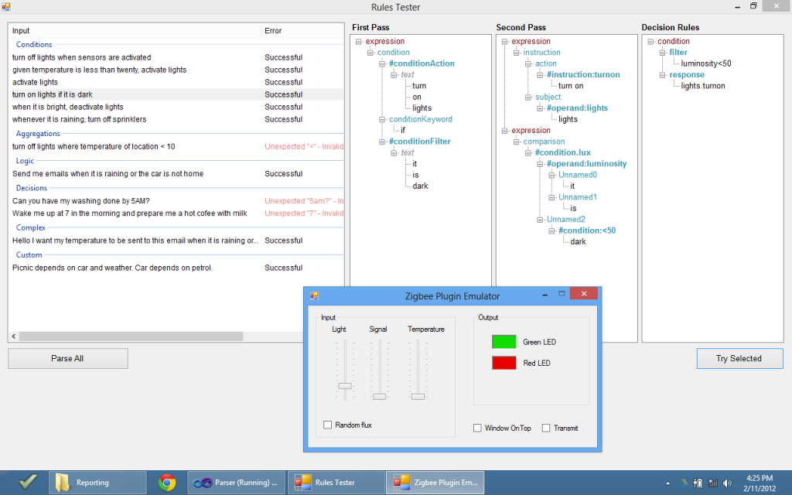

For my capstone thesis for my final year at university I looked at bridging the multitude of networks of sensors and actuators that will soon become household items into the hands of an ordinary non-technical user.

### Abstract

> As smaller and cheaper electronic devices obtain network connectivity, the possibilities of the Internet of Things grows exponentially. Ambient devices will soon pervade the ordinary home and office and be capable of controlling and reporting on many aspects of their environment. Configuring these agents to work together however requires domain-specific technical expertise, which prevents the average user from utilising the maximum potential from the synergy of hardware capabilities.

> The solution involves removing the need for the user to consider the low level implementation, and instead shifting their focus purely to negotiating high level business requirements which any non-technical user could provide. This capstone project aims to develop a software system to bridge the gap between everyday users and these ambient devices through a natural language interface.

