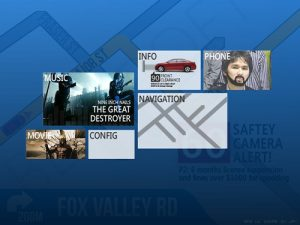

It was in the Autumn of 2009, long before Android Auto and Apple Carplay, when a good friend of mine, who had been pretty disheartened by the severe lack of creativity of the infotainment capabilities of our cars, decided to start the project to build one ourselves a Car PC for each of our cars.

My friend, Andrew, handled the hardware while I would be authoring the software. Naturally I looked to WPF with its rich UI, excellent integration with the Expression Blends designer and strong .NET libraries for business logic to create the evolutionary prototype.

Once the touch screens were set up we had a basic music player ready.

Then we played around with making an in house GPS system using OpenStreet map data and a basic A* algorithm for routing.

A microserver from home would gather traffic, petrol prices, weather details and social media updates and send it to the Car PC. The idea was it to use affect the routing algorithm but we never got round to that, given the showstopper of us having no open APIs for geolocation (converting an address to GPS coordinates).

Voice synthesis and basic commands was easy to implement but difficult to get right in the field with so much background noise. We were far from today’s Google Now and Siri and settled for hardware buttons on our steering wheels, but being teenagers we got a laugh out of making the text to speech swear at us.

While the project was never officially finished, life got in the way and the Google Maps app and streaming music meant we used the system less. It’s great to however see systems such as Android Auto on aftermarket headsets so that naive armatures like us don’t need to try and invent an entire platform, and focus more on the individual apps. I leave you now with some concept art which never made light.

 

The fourth prototype I wrote involved learning heavily from past issues and implementing patterns which would alleviate some of the maintainability issues experienced in the previous versions. This involved strong adherance to MVVM, inversion of control, mockable services and strong test coverage. The code was recently open sourced given its infeasibility, now with cheap Android double-din tablets and the likes of Android Auto.

**Source:** https://github.com/jaywick/caros4/