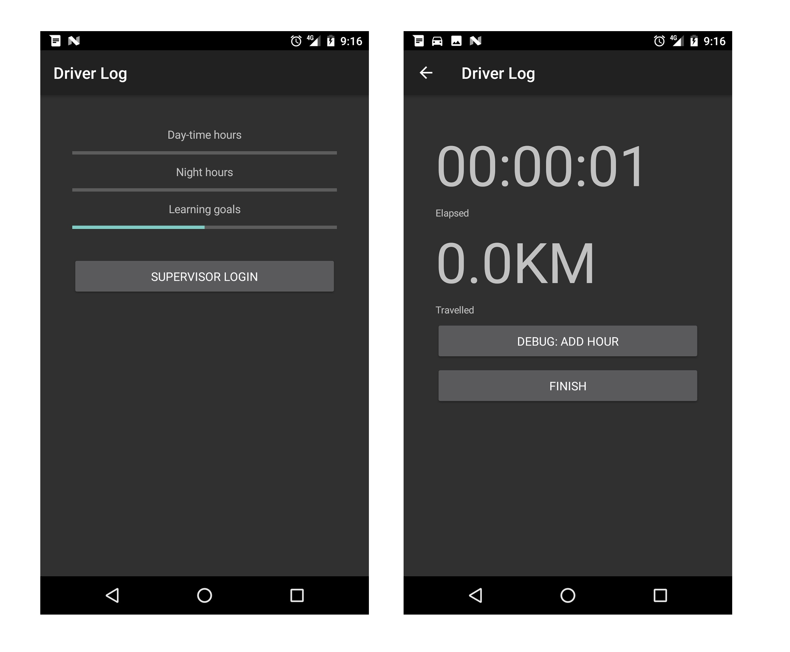
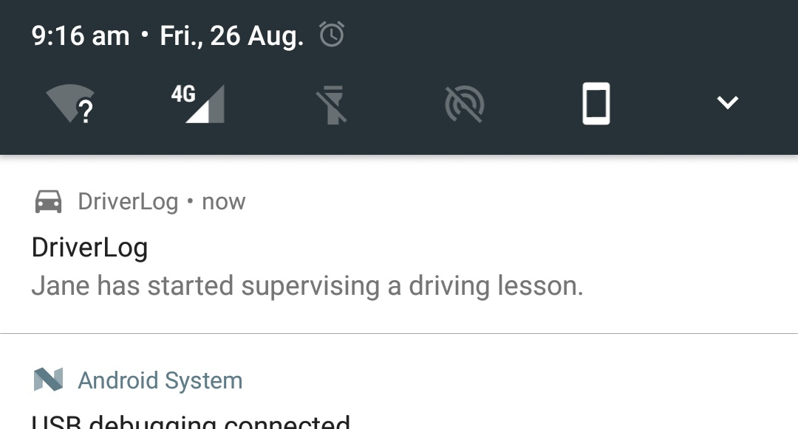

As part of Transport for New South Wales competition I built a quick skeleton app for logging learner driver hours. Unfortunately only organisations who had already built such applications made it through, so it made sense to open this now redundant code up for the public!

**Source:** https://github.com/jaywick/driverlog/tree/master

