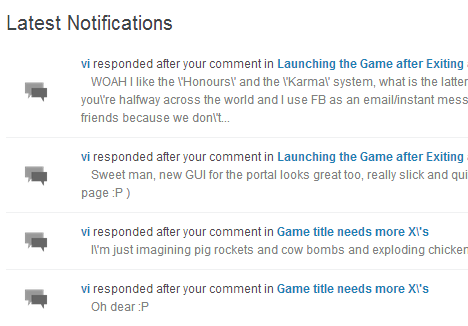

For any private beta testing for my projects I have a dedicated portal which handles feedback such as comments, tips and complaints. It works similarly to GetSatisfaction and UserVoice style web applications, however is deeply integrated currently with the Blackstorm Alpha project.

It was the limitations of the free versions of the aforementioned sites that led me to write my own. As more of my projects are finalised and published, I expect to detach the jet fighter stuff and allow more general comments and feedback.

The difference with this tailor made feedback site is in what I as the admin can see, which is the commitment of the users and their value to the project. Not all users have the same stakes here, as some can be valuable stakeholders or partners and others just armchair critics. I am better able to consider the users experience, their history of help and many other factors to prioritise tickets and shift the direction and evolution of the project.

