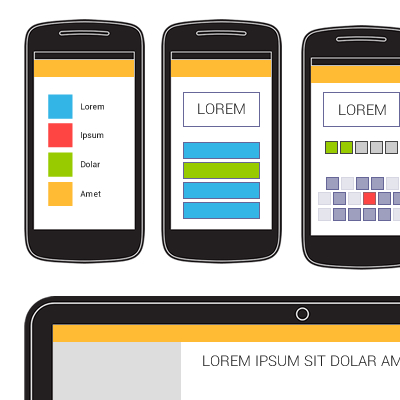
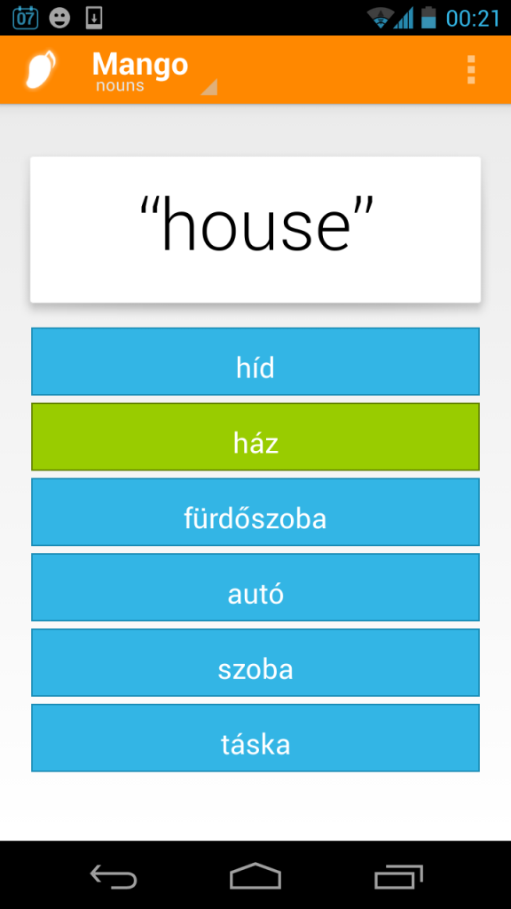
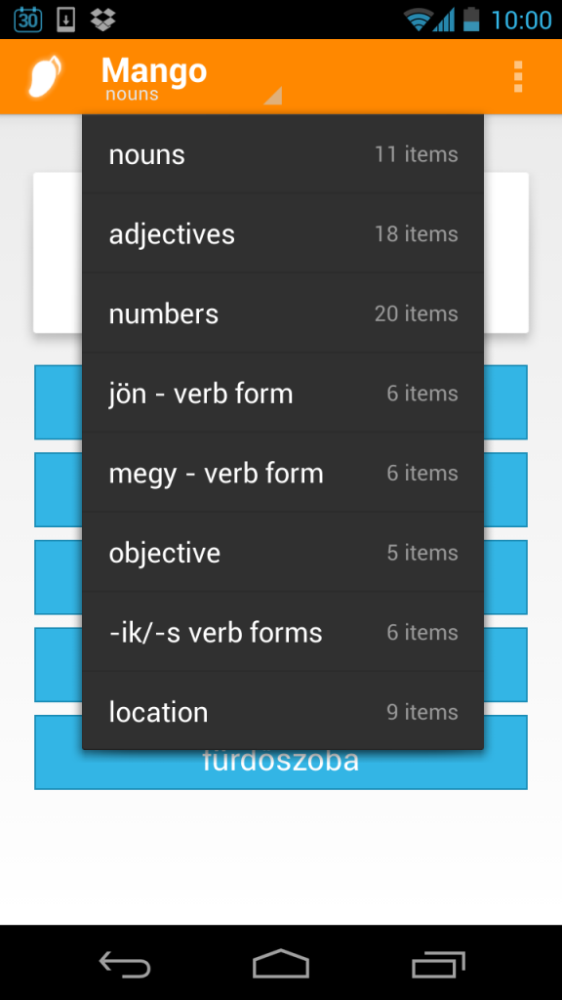
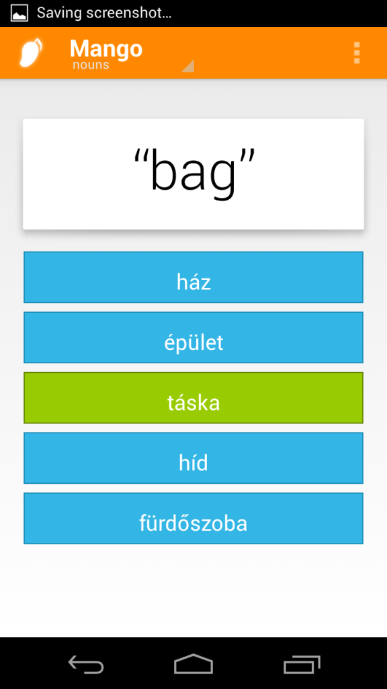
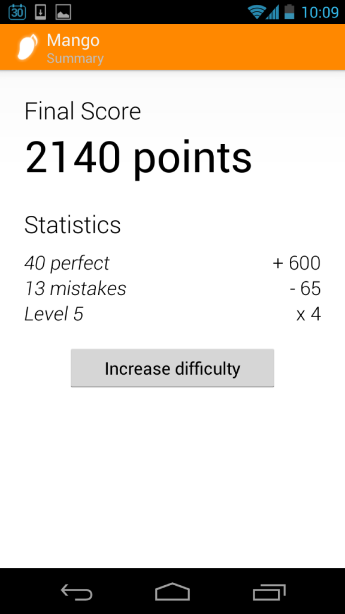
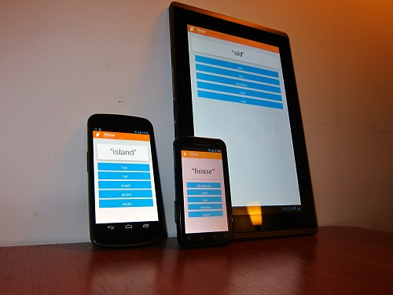

A quick app I wrote up instead of studying for my language class, the testing of which luckily engraved what I needed to know into my head. In many ways Mango will assist in self-teaching. That literally means you choose what you learn. What ever you need to remember, you put the data in and be presented with questions in different forms to help memorise.

