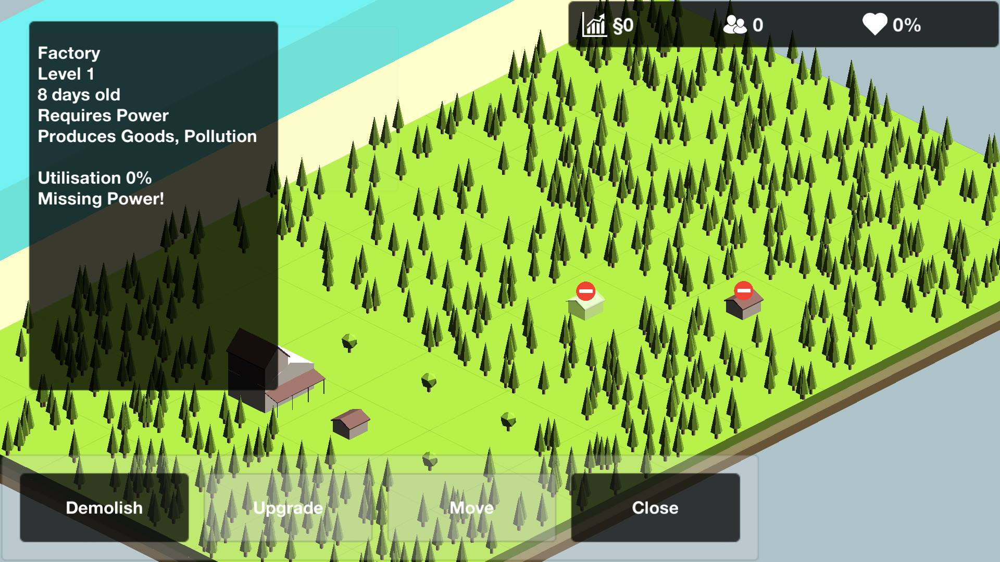

OpenCity is a puzzle meets city simulator inspired by the state of affairs with a microtransaction-filled click-and-wait market. Built using Unity and C# with Visual Studio the game became a nice little exercise in coding a nice model with inheritance and unit tests.

This game is deep in development and hopefully we'll get to see it in the Play store one day. Stay tuned for more!
