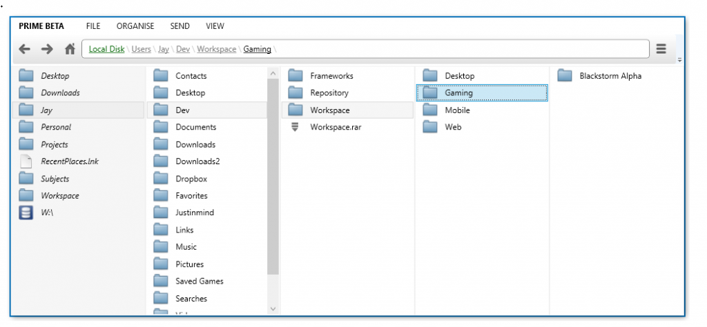
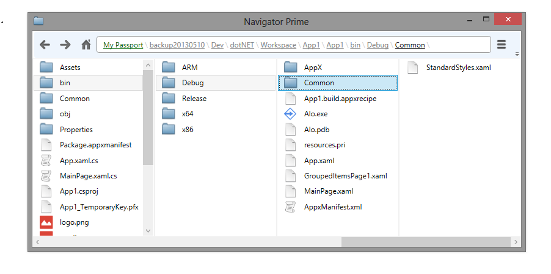
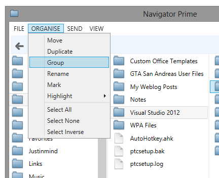
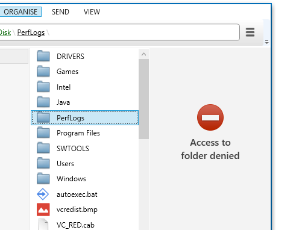

An alternative to Windows Explorer focused on organisation and situational awareness. Inspired by the Miller columns design (most notable in Apple’s Mac OSX Finder). The program remains minimalist with strong extensibility available planned for power users. My aim with this project is to figure out what annoys me most about Windows Explorer and find a solution.

Some such features continuing the heirarchy of a shortcut to a folder (instead of teleporting to the destination), grouping selected items into a new folder and marking items for actions.

Currently this project isn't getting much attention, but I would most likely be looking to convert this over to an Electron or UWP app.

**Source:** https://github.com/jaywick/prime

