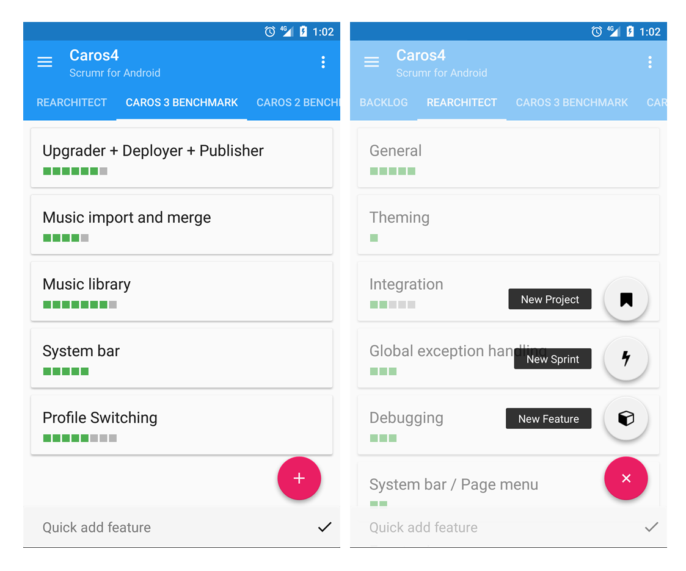
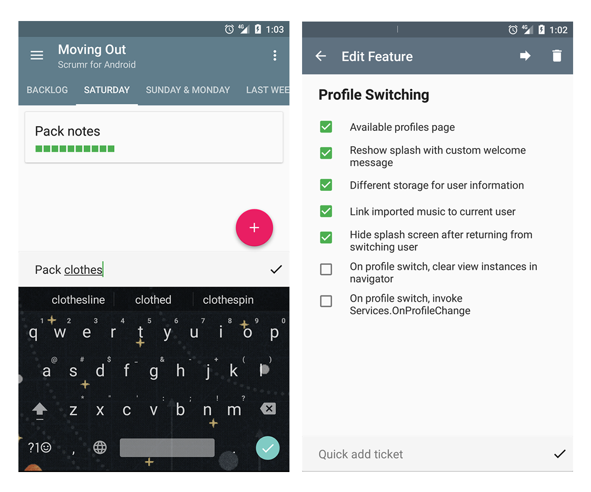
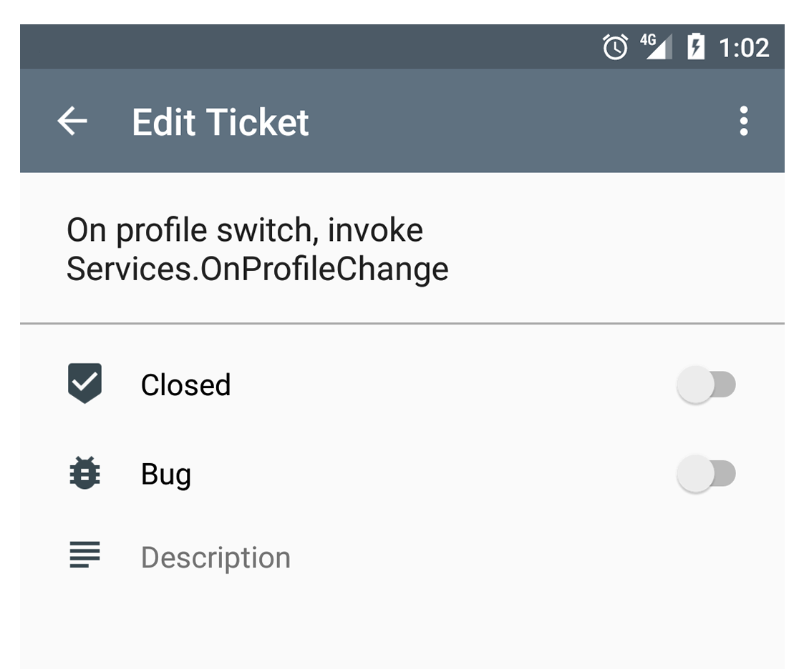

Just as I used [Scrumr for PC](/portfolio/scrumr-pc) on my desktop, it was through Scrumr for Android I managed my tasks on the go.

It followed the same concepts of projects, sprints, features and tasks.

Features such as quick adding tasks and features were ideal for me, and worked much better than Google Keep or other task apps.

And tasks themselves catered for finer details.

I put the project on hold once Xamarin was aquired by Microsoft, as developing in a language I had more years on and the ability to publish to multiple platforms including Windows 10 and iOS made more sense.