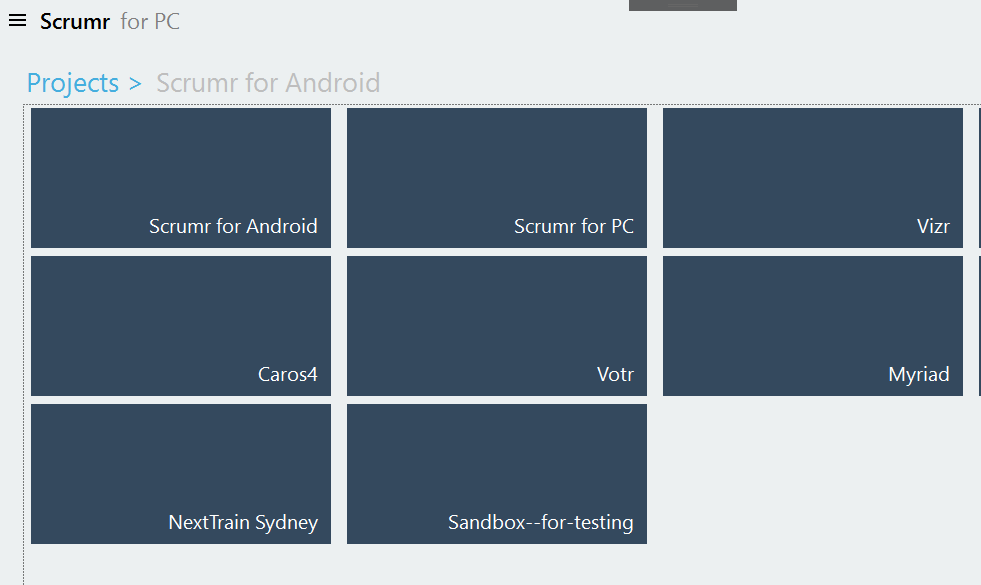
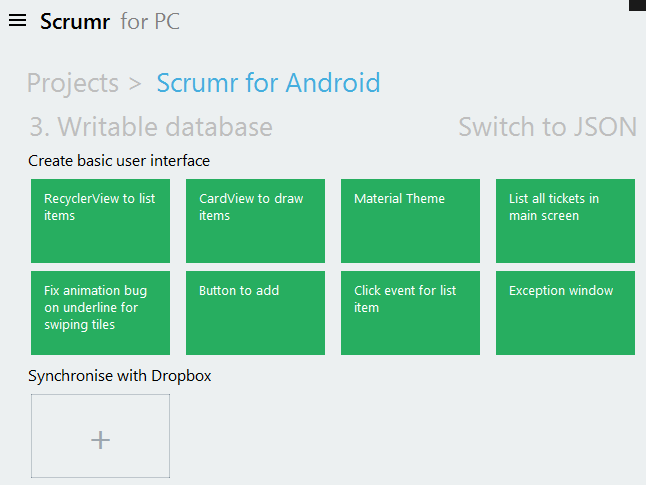
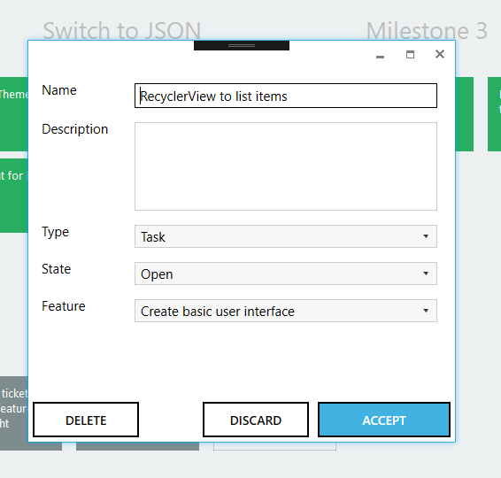

Post it notes are fun and all for sprint planning but you gotta right digitise this. For my personal projects thus far I wrote and used Scrumr for PC ([and Android](/portfolio/scrumr-android)).

This project was abandoned once I started work on Electron, which spawned the project [Sprintr](/portfolio/sprintr), Scrumr's cross platform answer.

**Source:** https://github.com/jaywick/scrumr-pc

