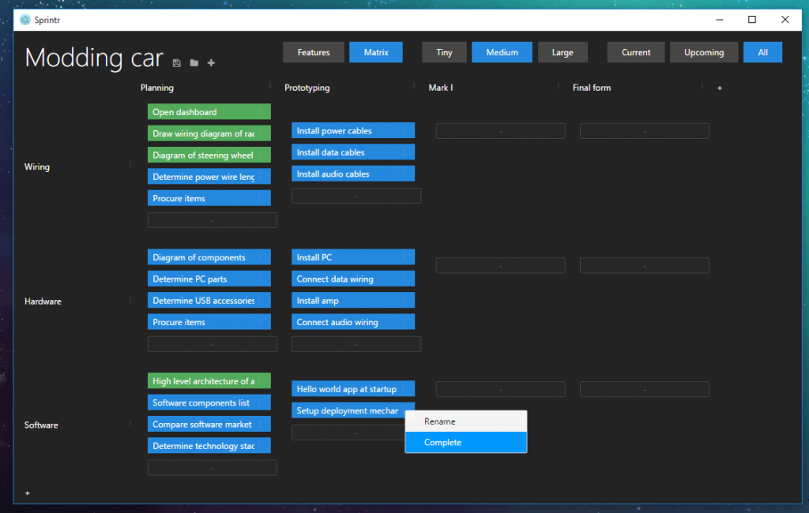
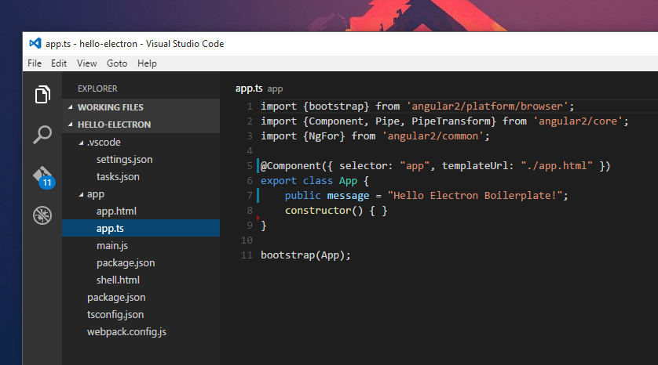

The way I handle my own person tasks has grown and to formalise the workflow I wrote Sprintr. Tasks go under a tree hierarchy of features and placed in on a board of Sprints. I had already Scrumr for Android to handle managing tasks on the go, but I needed something for the PC. This was also a good introduction to Electron and Angular 2, moving away from WPF.

