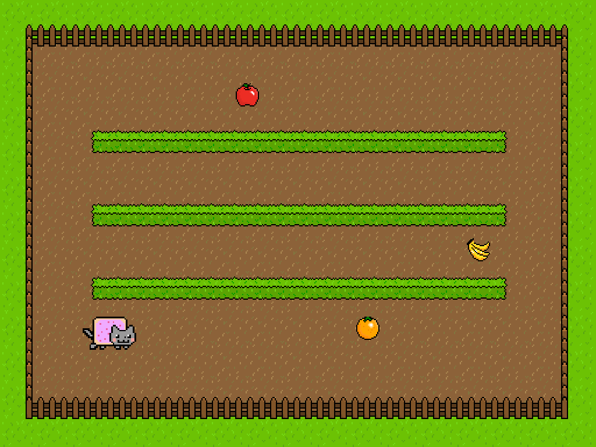

Late 2013 I had the joy of being part of the biannual LevelUp workshops hosted by ThoughtWorks, here in Sydney. It was a nine week course on modern Agile software developement (extreme programming) using Test Driven Development.

Our project was to built a two-player fruit collecting game in Lua. This involved liaising with a client and pitching our solution as part of a mock-consultancy game development project.

**Source:** https://github.com/twlevelup/syd-levelup-2-red-team