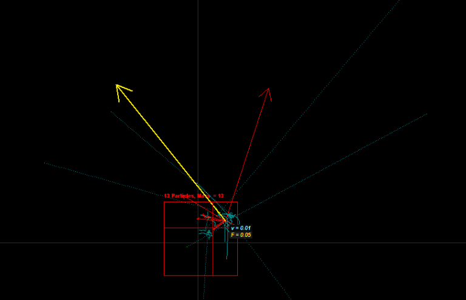

Universe in Hand was a little program I worked on in high school which originally started off as a pixel generator. Learning more about physics it evolved to my environment and soon became somewhat of a particle accelerator like screensaver for me.

It would always be interesting keeping it on for a few hours and to see what it would draw. No matter what, floating point imprecisions and the random variables about the computer drawing the trails would always yield a different output no matter how similar the original conditions.

<YouTube id='fXCh85tTX8k'/>

