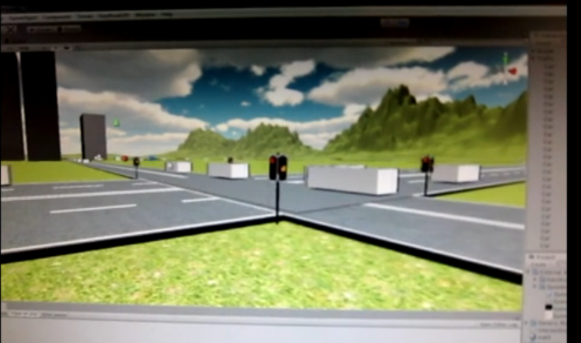
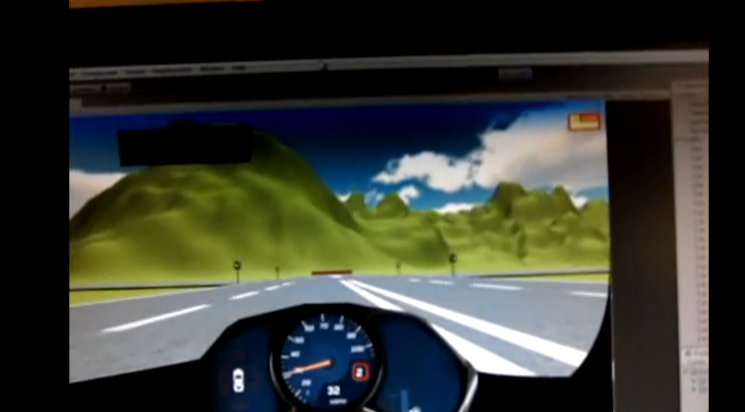
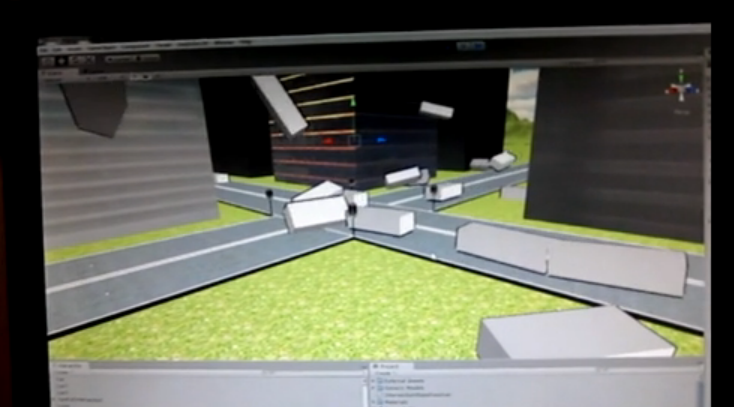

<Vimeo id='32312835' />

Given my experience with the Car PC project, I was designated technical lead for our advanced project for a difficult final year subject. Despite also working on the robot project that semester, I managed to draft a good high-level and low-level architecture as well as design the entire simulation in just a week.

The simulation featured an actual steering wheel game controller with vibration feedback on crashes, automatic parking and when going off-road! The point of the project was to show innovation in safety systems.

Along with interfacing with physical sensors and having background services for traffic algorithms the project was way overkill and I was sort of told off for spending too much effort on it, but it was so fun to make. The videos are worth a watch, preferably the traffic simulation when I turned all the lights green in the city. A lot of what I learnt new about the Unity engine I was able to put back into the Blackstorm Alpha project.

