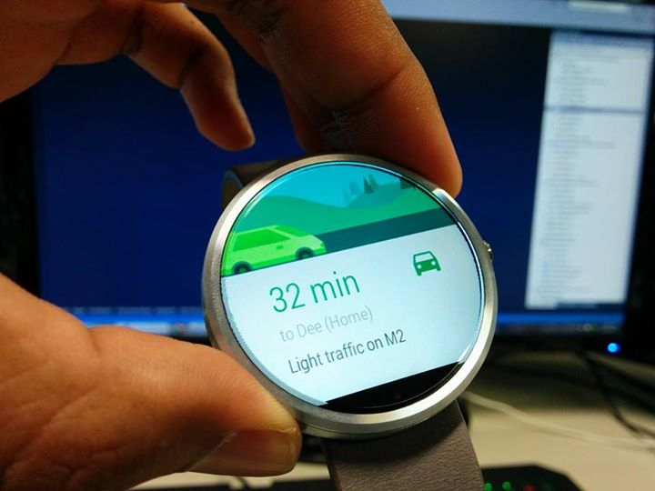
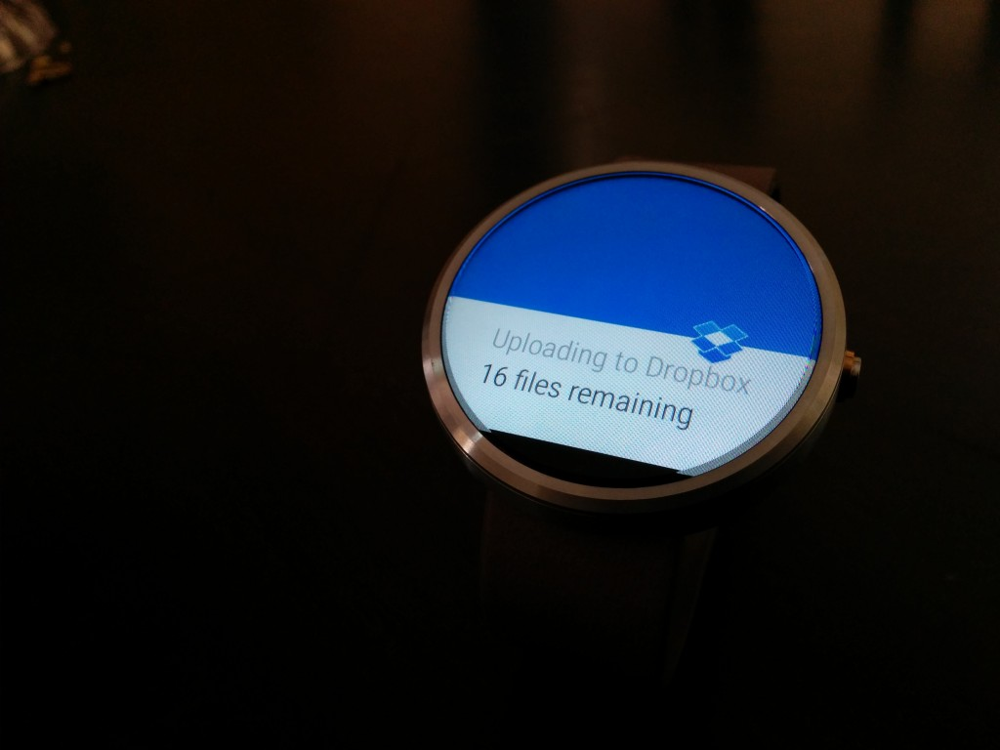
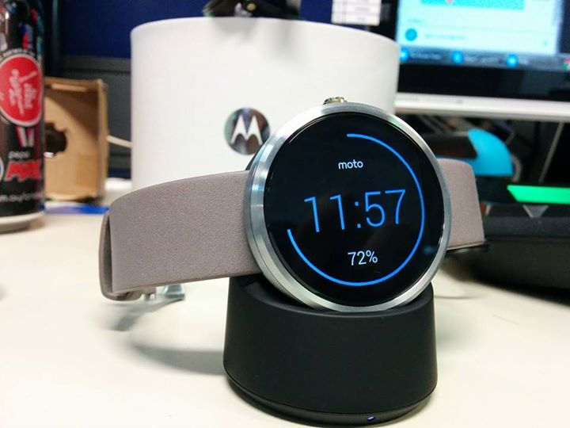
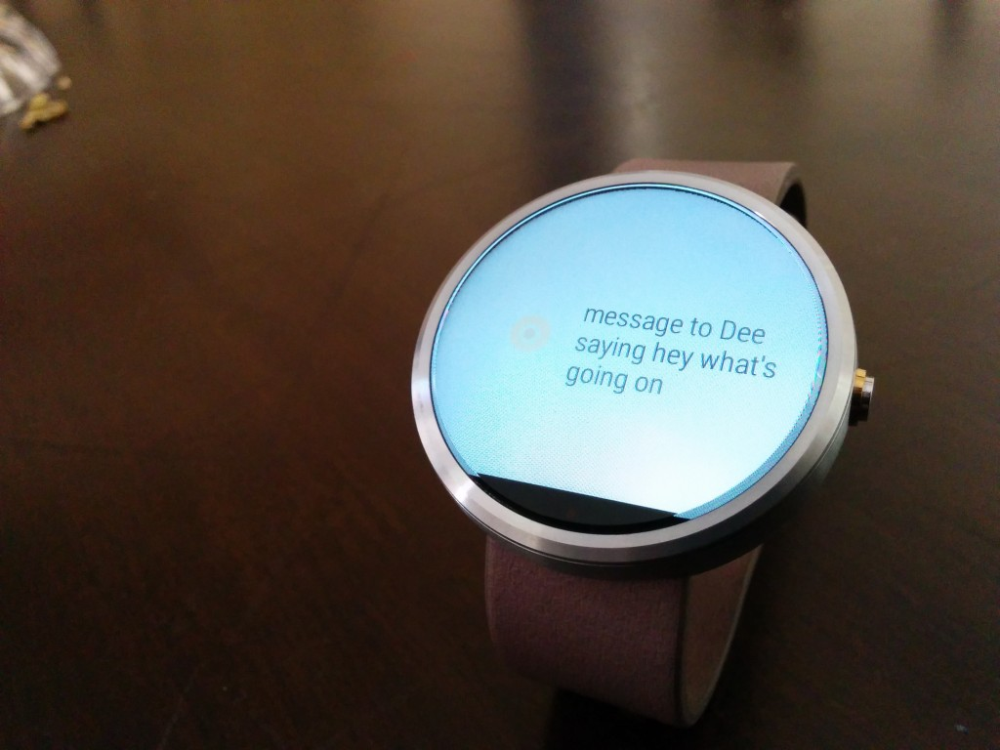
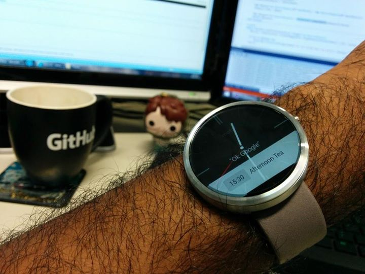
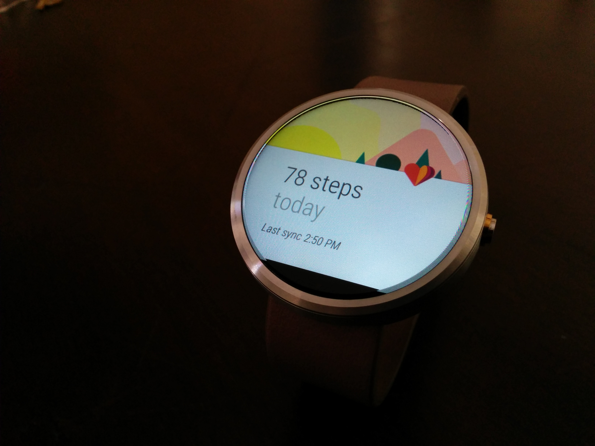
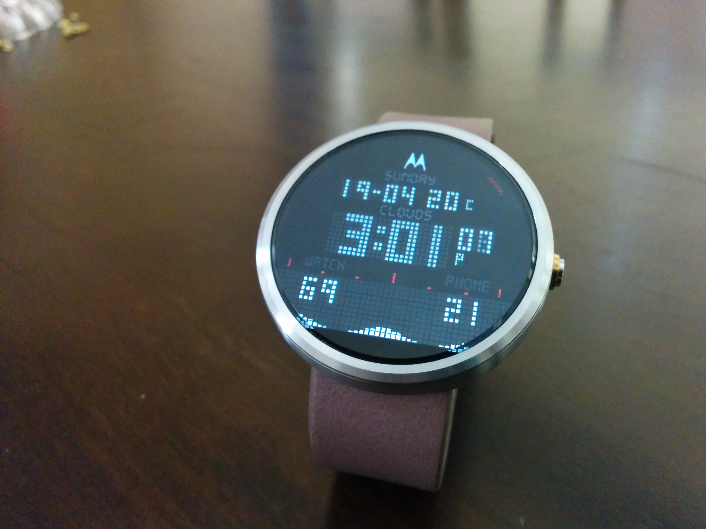

It's been 90 days since Dee got me my Moto 360. I've had it on almost all the time and installed everything I could find. I'm addicted to new gadgets, especially when you can hack and customise the crap out of it. Suddenly, you could get short bursts of information at a glance of your wrist, you could interact with information faster and get on with what you were doing. But it didn't take too long for me to hate it.

****

Android Wear works by showing the same notifications from your phone onto your watch. So when that annoying friend on Facebook tag-shares you'll get that on your wrist. Hey look more recruitment-spam from LinkedIn. Oh look Flappy 2048 is saying it's been a whole hour since you last played the game. Suddenly your wrist which was once either free or devoted to one thing: showing the time, becomes the center of attention with a gadget that vibrates like its enforcing electric shock therapy for being milliseconds out of touch with your digital life. It might as well be a color around your neck, because that's how you'll feel, a slave to all your apps.

Now I get calls, reminders, emails and text on my fricken watch. It made me like the concept of Virtual Reality glasses even less. There was a reason I put my phone on silent and shoved it back into my pocket. It's cause we're flooded with useless notifications in a every busy life. When I finally did customise the crap out of my notifications, my wrist was dead silent for a while. No vibrations. No popups. Just a glorified watch with customisable faces. I came to realise how much I valued my peace. I've opted for pull notifications over push and quiet notification counters of over pop ups, becauses theres far too many things that require our attention that are meaningful to our existence than *'A new tournament has started, click to play!'*.

Until smart watches no longer need your phone to be paired and there's actual stand alone apps that prove useful on that platform, you'll find yourself sadly disappointed. Sure, you can get notifications of train timetables, real estate or ebay listings but they're just duplicates of what exist on the phone's notification tray. There's no added functionality. It's not like your phone is at home, it's in your pocket, this whole "quick glance without your phone" marketing omits the fact your phone is still required.

## On the other hand

But enough hatin'. Despite its practical issues, the Moto 360 is the most beautiful smartwatch I've yet seen.

I didn't even ask for directions, but Google thinks I should go to Dee's.

I don't care what Dropbox is doing. But of course you can always disable apps from showing up.
 

Switches to a night clock screen when on the wireless charger.

The voice recognition is pretty good but fails in noisy environments. I love that you don't need to split up your actions and say the entire command in one go.

Hey look it's tea time!

Hey look, you're lazy.

My favourite watchface - [Nixon Weather v2](https://plus.google.com/photos/+ZhouYeow/albums/6134162533275625633/6134162532043831906?sqi=100528130097464336279&sqsi=9f22d087-8c72-47c7-8a88-3625b2b7425b&pid=6134162532043831906&oid=116187016041732122937).

## Your mileage *will* vary

I didn't purchase the Moto 360 myself, it was a gift and I was able to review it without really feeling any cognitive dissonance or buyers apologeticisms. These devices are more of a fashion statement than practical user interaction breakthroughs, and it's just the first generation. Hopefully we'll see greater improvements to come.

For more Wear watch faces check out

*   [facerepo.com](https://facerepo.com)
*   [/r/androidwatchfaces/](https://www.reddit.com/r/androidwatchfaces/)
*   [+WatchMaker - Beautiful Watches for Android Wear](https://plus.google.com/communities/106982503578105386202)
 
Featured image is [iWatch de Apple](https://facerepo.com/app/faces/details/iwatch-14af9ae92bd) for Watchmaker.