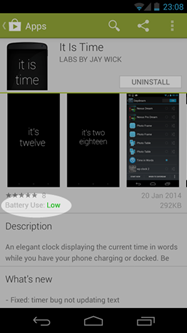

Given the evolution of the modern day mobile OS we've grown accustom to things we never cared about before.

Android with its infinite customisability was the answer to my often odd requirements for a mobile phone system. From contact sync to automated tasks, my needs grew as the ecosystem evolved. Suddenly I needed things I never wanted before like [text clock screensavers](/blog/50/it-is-time-for-a-little-zen-while-your-device-charges/) that appear while charging your phone.

I figured there were some core things missing from I would really like in the not too distant future. Here's a list of things I think could be included into the Android experience with a little concept art...

****

# 1. Split Screen Multitasking

Windows 7 was the first to intro me to snapping windows left and right. An awesome productivity boost allowing two windows to share the screen. Microsoft also pushed this into its \"modern\" metro environment and I would love to see this on my Android phone. Do note that Samsung has done this, come on Google, bring it to the stock ROMs!

 

# 2. Battery Drain Info on Play Store

Given that Android supports background services, allowing for really useful things ranging from automatic profile triggers to automatic backups. However some developers feel the need to have their apps always running in the background for some reason (just like [those that slow your PC down](/blog/54/technique-1-in-fixing-slow-computers-comic/)). This slows us right down, and kills battery really quickly.

Instead of relying on user comments complaining about battery life, why not some kind of automated benchmark that would show users an app's impact?

# 3. Google Hangouts Floating Notifications

Just as Facebook messenger has floating notifications (aka chat heads) perhaps Hangouts (now the default SMS app for the Nexus 5). This would allow you to quickly respond without leaving your current app.

 

# 4. Settings Search

Don't get me wrong, I love going through settings and tweaking something until its unrecognisable. But there's nothing worse than having to go through all of them to change that one setting you couldn't find. How about a search filter to make that easier?

# 5. Google Now API

I feel that [Google Now](https://www.google.com.au/landing/now/) will probably be have a greater presence on wearables, mostly because you can interface with it through speech and you don't have to reply on a screen. How cool would it be to have Google's little AI interface with your apps?

# 6. Profiles for Mobile Phones

Profiles are available on modern Android tablets but made unavailable for phones as not many people share phones and the question of would calls be blocked if the user was not currently logged in. But maybe at least an inbuilt way to switch to Work or Home account?

# 7. Play YouTube in Background

Ok sure, it doesn't make much sense to watch videos while reading news at the same time but maybe support background playback so we can listen to our favourite [chillstep](https://www.youtube.com/user/OnlyChillstep)?

