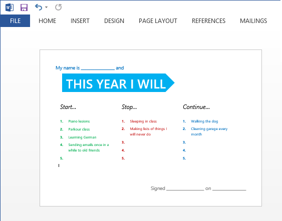

There's nothing worse than starting the year with a list of expectations. Forget making that same old New Year's Resolution, and instead run a retrospective on the year just gone by.

Let's borrow a page from [Agile software development](https://agilemanifesto.org/): the concept of retrospectives. Retros are a look back at what was done so far (over a small timescale). A common method is in asking *The 4 Questions*...

****

1. **What went well?** Start by considering what was good this year

2. **What didn't go so well?** Things which did fell short of our expectations

3. **What have I learned?** Things you have come to realise

4. **What still puzzles me?** The questions and uncertainties

Laura M. Waite And Collin Lyons have [written a great article](https://www.infoq.com/articles/4-questions-retrospective) discussing how to answer each question, and how to then improve your productivity at achieving goals.

# What's Next?

Answering these questions is a good start to understanding how the year went, yet we still have to transform these into things which can be done. This is where the *Start, Stop, Continue, More of, Less Of* technique comes in.

Now simply transform your raw thoughts from the 4 questions into actions that can be placed into one of these groups

1.  Things to start 
2.  Things to stop 
3.  Things to continue doing 
4.  Things to do more of 
5.  Things to do less of 

I tend to merge the last two with the others to keep things simple. The *Start, Stop, Continue* method is the simplest feedback technique to improving productivity. Try it out, place it up on the wall and don't be shy to change it if it looks unreasonably or circumstances change!

Here's a [Word document template](https://sdrv.ms/1cD5RCm) and a [PDF](https://sdrv.ms/1cD5LKS) you may find useful!

And have a safe and happy new year!