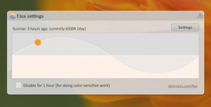

Maybe it's because I'm a night person, or because I don't have much natural light in my room. But I just like my screens dim.

I couldn't find a good screen dimmer for my multi-monitor PC setup so I evolved on an [existing one](https://github.com/DHIteration/DimScreen) I found in the wild. Check out my fork of DimScreen for a multiple-monitor screen dimmer:

****

https://github.com/jaywick/DimScreen

If compiling source code isn't your thing, you can grab the installers from [Releases](https://github.com/jaywick/DimScreen/releases).

*Note: requires .NET 4*

I can see myself automating this very much like [Flux](https://justgetflux.com/), which only changes the colour temperature of the monitor.

