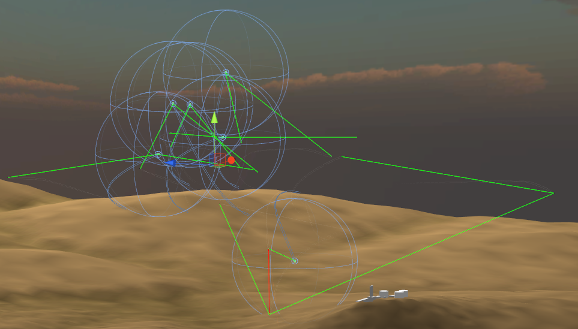
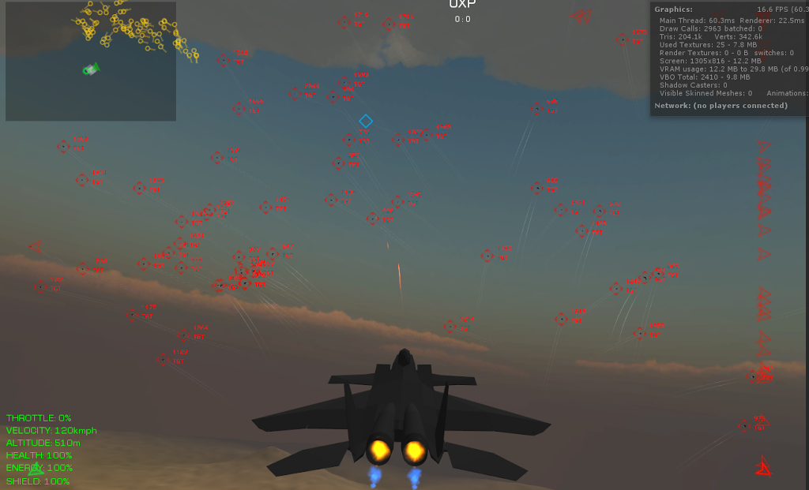
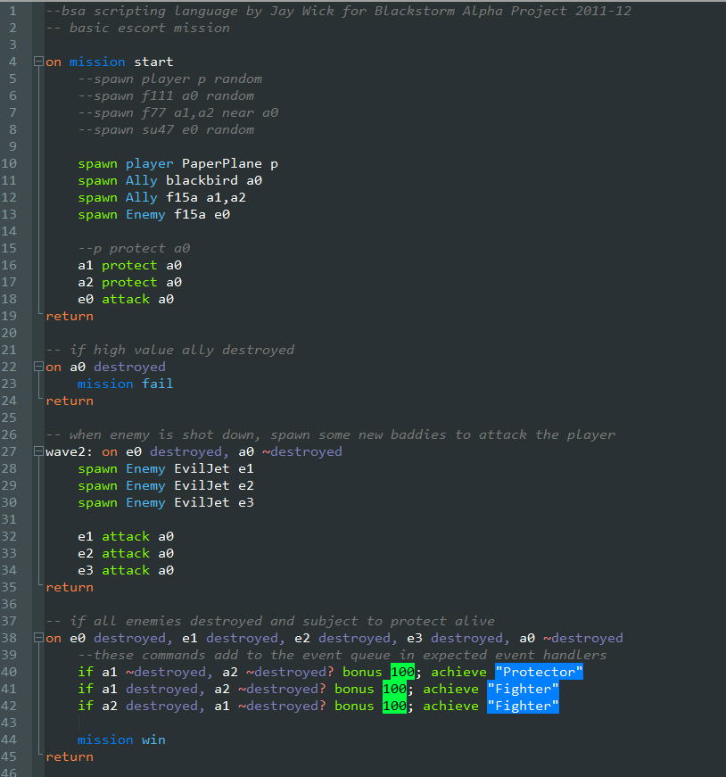

Given how much time I spend on my own personal endeavours, it’s a wonder that I still have friends. But who needs friends when you can make your own allies? Allies who fight against enemies you've made yourself.

There’s only one direction this game will go, and that’s multiplayer. Instead of indulging in that pipe dream, I focused more on getting the bots to behave...

****

Currently, the bots are processed in swarms based on a hybrid algorithm using distance and status. A baddie who’s flying in a swarm while being targeted will act differently to a let’s say a lone baddie who’s already made some clean kills.

 

It’s interesting to add 100 allies and 100 enemies and see what happens aided by different types of cameras (including target focus, fly-bys and 360s).

 

I've started experimenting with scripting for scenario directing, and made a quick format which handles a basic publisher/subscriber event model and transaction-oriented imperatives.