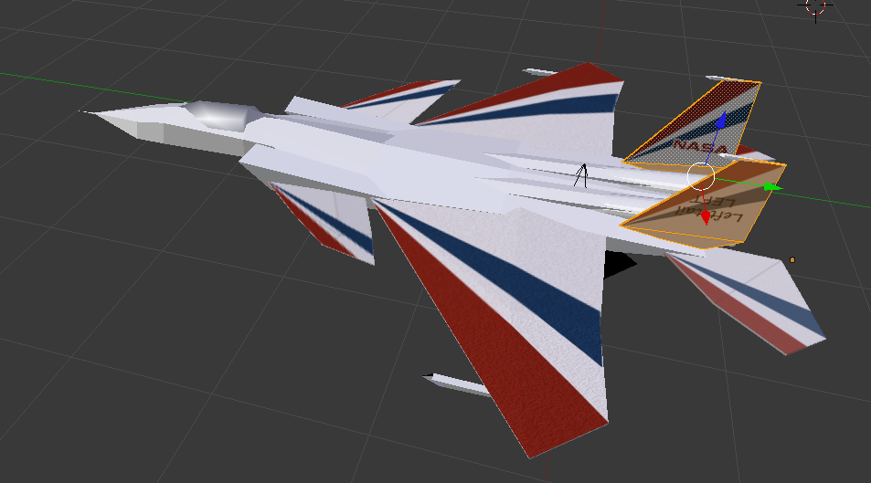
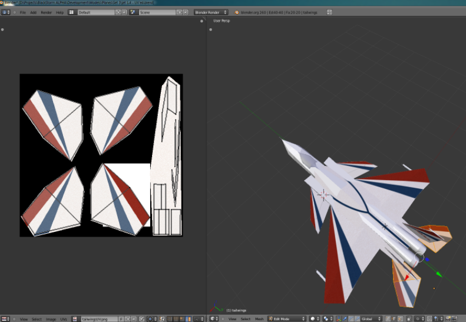

If I had to choose my favourite machine, it would have to be the **F15-Active**.

I mean seriously, they made something as aggressive as the F15 Eagle look like a kite! A kite capable of a top speed of 2,645 km/h! But that’s not what’s impressive, it can actually take off at speeds as low as 68km/h! It was designed as a technology demonstrator, before being acquired by NASA for more R&D for the sake of R&D, I just love that.

It seems only fitting that I try to make a clone in [my own jet fighter game](/portfolio/blackstorm-alpha)...

****

An early prototype. Far better than my [previous attempts](/blog/73/scrambling-the-variant-its-time-for-another-vid/). Thank goodness for [forced rewrites](/blog/66/anyone-can-write-code-good-coders-rewrite/).

UV Mapping is quite simple once you get used to it.

All we see above only took a day to make. You might want to add a few more days for learning how to get your head around using [Blender](https://www.blender.org/) haha!

In terms of the game itself, I’ve been spending a lot of time working on the higher-level components such as gameplay management, internal scripting, blah blah. I’ll get round to posting stuff I do in that area some time. I just had to post now how awesome this jet is :D