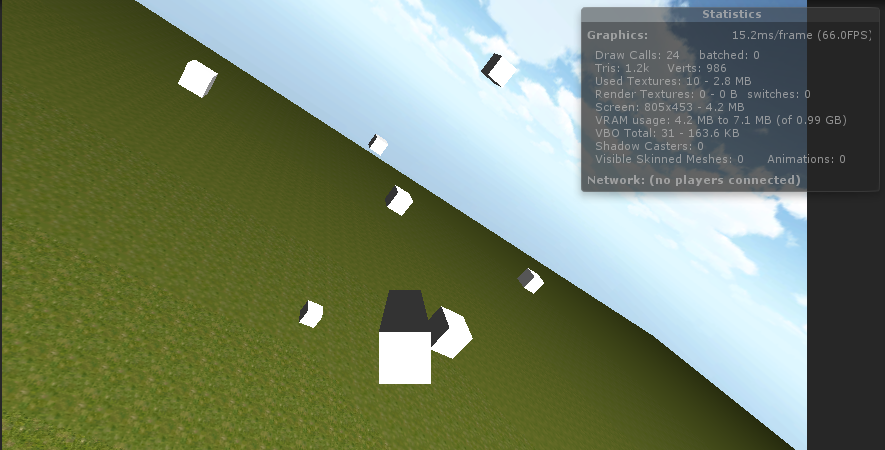
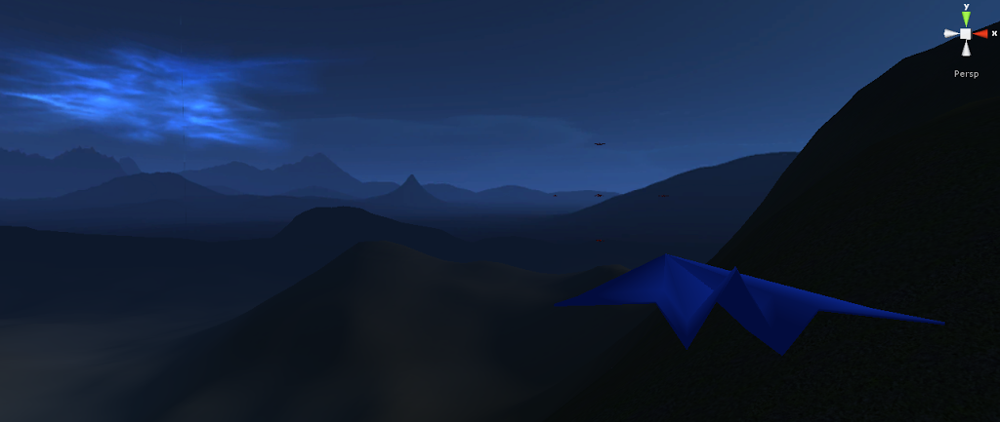
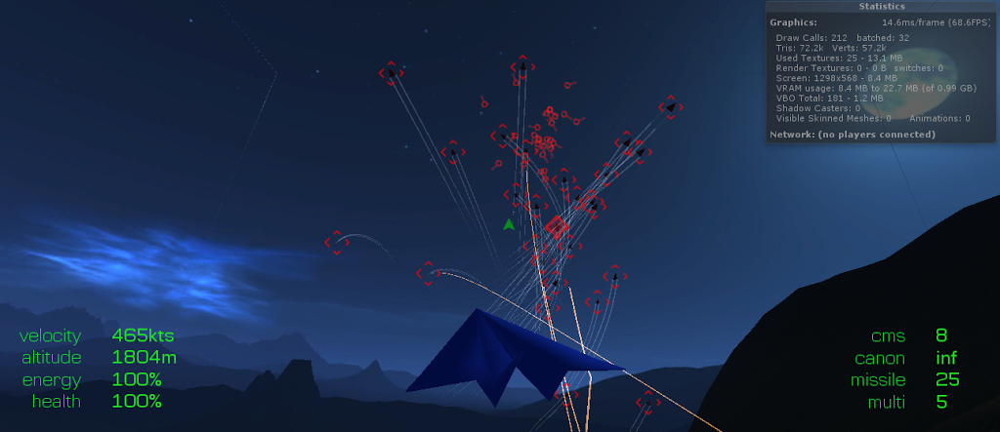
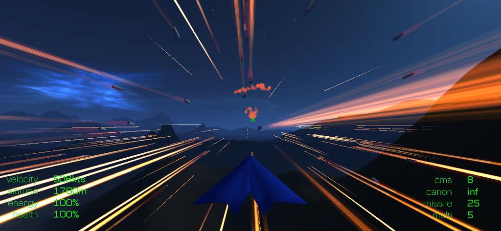

It's not the first time I'll be rewriting that whole crazy jet fighter combat simulator arcade thing.

I came to realise [in a recent post](/blog/66/anyone-can-write-code-good-coders-rewrite/) that I'm never happy with what I've done. Which turned out well for me because I lost all my project files.

A few months ago my machine decided to cough up blood and report [heavy hard drive failure jargon](https://superuser.com/questions/330561/interpreting-hard-drive-status-from-s-m-a-r-t-results). What's more in the process of restoring the backups *the backup drive itself* decided to fail as well.

I took it as I would any sign from above and naturally ignored it. It was time to rewrite – *everything!*

Yes I lost the [plane models](https://jaywick.io/blog/74/will-it-blend/) too, but this time I thought I'd focus more on the game than the models. Hence the new air-superiority paper-plane...

That beautiful sunny day scene was starting to depress me as well. It was time to post-apocalyptic-ise the place!

Lots of enemies. Far less lag.

Time to experiment with cool weapons I think.
