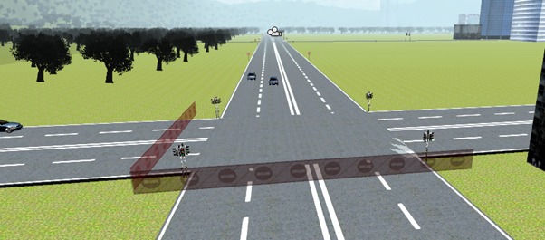

<Vimeo id='32312835' />

So we [designed the simulator](/blog/71/designing-a-simulator/), made the [traffic move](/blog/70/traffic-system/).

About time we took it for a test drive.

Some pictures of the world follow! No lengthy discussion on collision detection or ambient occlusion, *I promise.*

****

 We had originally planned on using a city generator. But throwing in cubes and grabbing textures off the net proved far easier.

The roads had names dedicated to each member of our team, and a few others who were following the project.

**The driving shown in the video is for educational and entertainment purposes only.** In the real world ensure you stick to the rules of the road and always obey gravity.