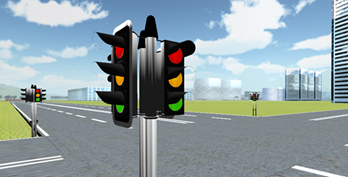
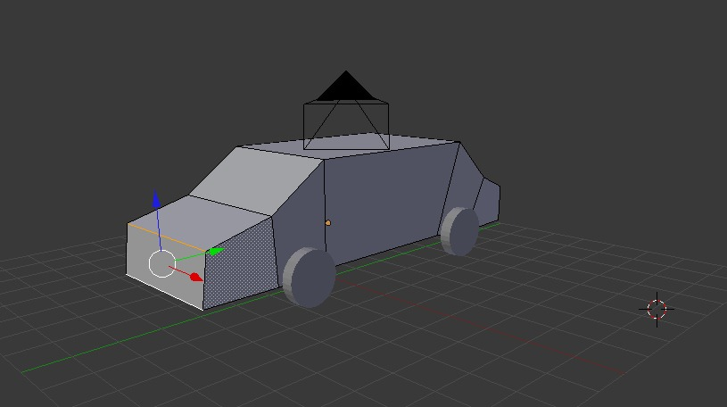
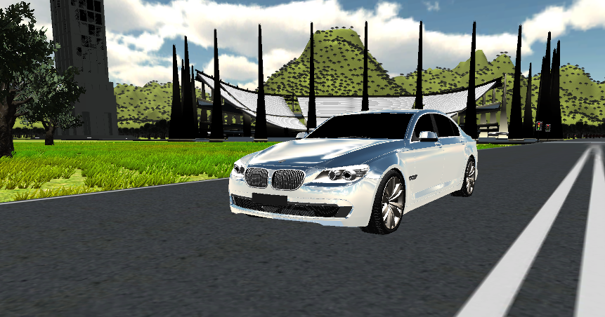

<Vimeo id='32306571' />

Developing an intelligent vehicle system meant designing a vehicle simulator, which then meant we had to simulate the world as well, and in that world we need other cars.

Check out the featured video is of me testing some Traffic AI!

Cars flying off? Doing burnouts? Quite simply, it was because there was no gravity. Each block (car) is set to go forward and only brake if there’s an obstacle or it arrives at an intersection. And in the event of any collision it will keep going 'forward'.

****

Unfortunately given the computational greedy nature of vehicle’s telematics systems we were showcasing, gravity calculations were removed by Quality testing.

The cars eventually evolved in shape as well.

And eventually I caved and downloaded some freebies from [Google's 3D Warehouse](https://sketchup.google.com/3dwarehouse/).

[Stay tuned](/portfolio/vts) to this project for more on the driving simulator itself!
