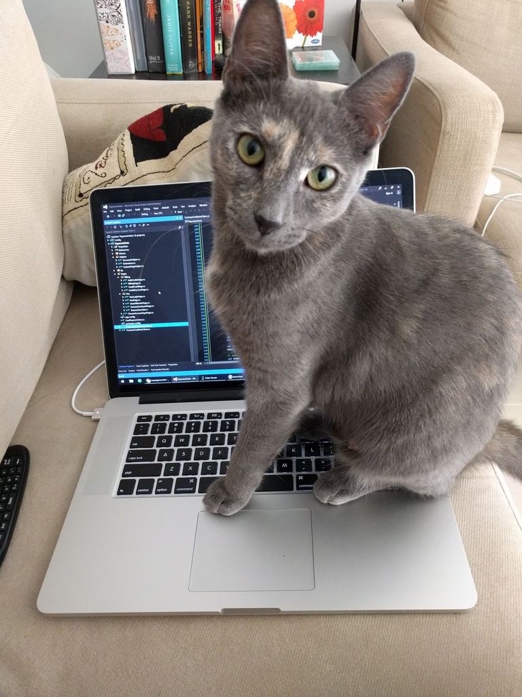
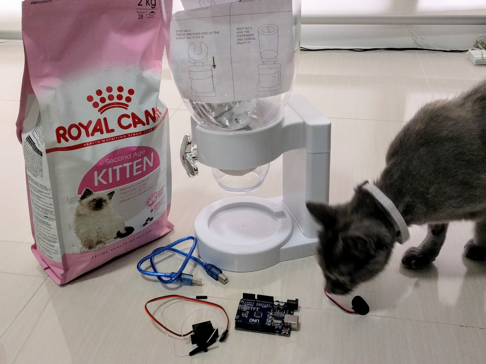

Her story is a little sad. Around her first birthday she became pregnant and was given up to a rescue. While taking care of her own, she even adopted another batch of kittens. As her babies grew, they were quickly adopted but she was left alone unwanted. Her story pulled on our heart strings and we just had to rescue her. She was kitty-litter trained, curious and intelligent but loving and sociable with other pets and kids, so it was a win-win!

Welcome home, Fi.

****

# Her Name
Back at my parents family home, we had two cats, and with my dad being a mathematics teacher affectionately (or debatably indifferently) named Alpha and Beta. This would be cause of much laughter with the kids as he'd be explaining his algebra and the cats would respond to their names.

So as a tribute, I was inspired to name her after the Greek letter ϕ but with a more feminine pronunciation and spelling.

_Sometimes also called Fifi, Foofoo, little snot or wierdo_

# Mood and anxiety
But besides all the geeky fun, she really has turned our house into a home. Pets are known to be extremely good for anxiety and general mood, and I'm finding myself more relaxed and rested. There's that validation when your pet needs you, that forgiving nature of them to not care about your faults or failings, and maybe it's the Oxytocin but I am finding myself a whole lot more patient and feeling responsible.

# Projects
Now anyone who knows what I like to buy myself would know it either has to have an SDK or API or atleast be hackable. Now it wouldn't make much sense if I didn't find any projects worth pursuing given her joining the family. So a week before she arrived I went on a shopping spree, buying myself an Arduino uno clone, a small servo and a cornflakes dispenser. I wanted to make an automatically timed food dispenser, or as my friends said _"to outsource responsibility"_ and _"eventually connect it to the internet and turn her into a [Tamagochi](https://en.wikipedia.org/wiki/Tamagotchi "yes this is how old people used to play before smartphones came out, you young'ens")"._

