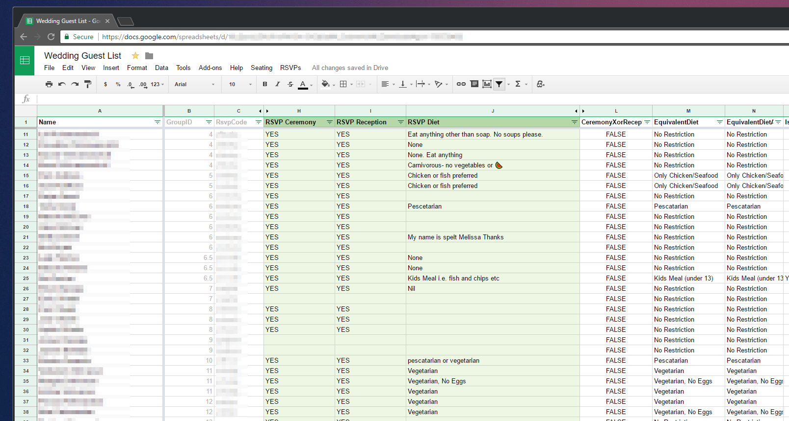
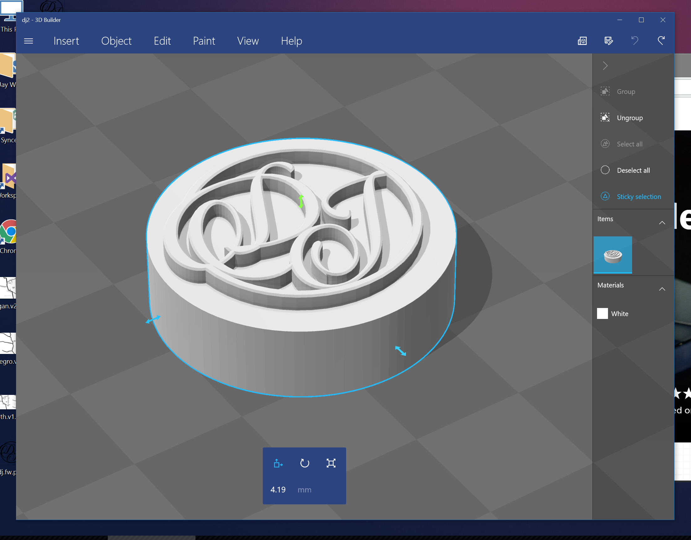
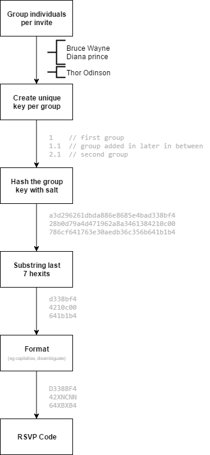
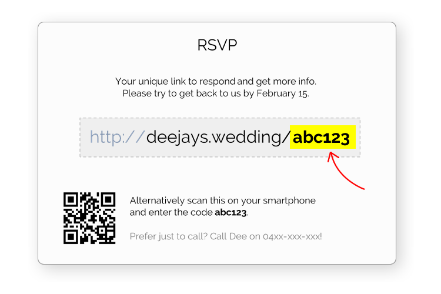
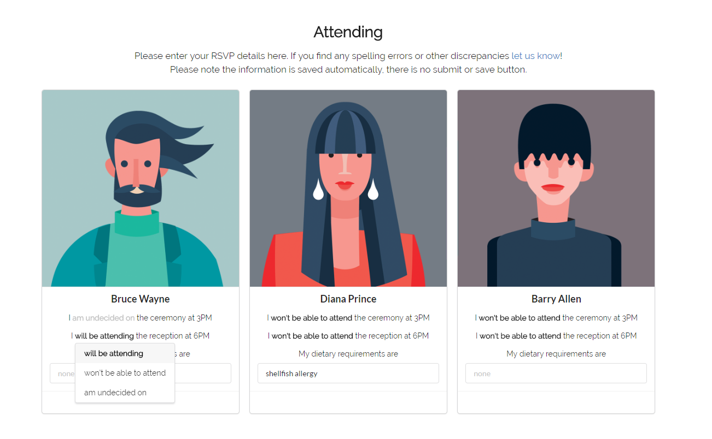

It's been about a month and a half since I married my girlfriend of ten years, Dee. We planned the wedding ourselves which meant we had say in every little detail, being the control freaks we are. But this blog isn't about love and mushy stuff, I want to share with you some tech hacks that helped out a lot throughout the process.

Where do I even being?

****

# Communication

First of all, we had a shared email to send to vendors when communicating. It forwarded to both our emails and we enabled Gmail to send mail as that account, with the agreement we'd BCC each others personal email when we do. This made sure both of us were in the loop and on the same page. Any new information would go to Google Docs and shared with our parents and bridal party so they were in the know as well. Now while Dee likes to write on paper and highlight, cross out and stain them with coffee cups, she agreed keeping things central made sense. It gave us the ability for us to add our own bits from anywhere, leave comments and approve changes.

# Task Management

We're massive Trello addicts, due dates, labels all with ICS support. I've been through Keep, Remember the Milk, Todoist, TargetProcess, Visual Studio Online, Google Tasks you name it. I've even tried to make my own back in the day with [Scrumr](https://jaywick.xyz/portfolio/scrumr-android) and [Sprintr](https://jaywick.xyz/portfolio/sprintr) but we could compromise on custom functionality for something tested by the masses. Plus its free and has a great API.

# Guests management 

Invitation information was stored in Google Sheets, allowing us to keep track of guest names, addresses, which invitation letter they were grouped into as well as their RSVP and diet responses. It seemed like a great middle ground between writing it up on manually vs spinning up my own db and hosting an admin page. Again, free and accessible to both of us--plus as it turned out  worked great even without an internet connection. There was also the option of extending functionality on it via the GApps script.



# Invitations

After days designing and redesigning the invites, we mail merged everyone's names and printed them out on custom paper at Officeworks. Dee heat treated some rose gold foil onto parts of the paper and for the finishing touches I 3D printed a custom wax stamp of our initials to seal the envelopes.



# RSVPs

Do people still use snail mail for RSVPs still? We agreed responding via the interwebs was the best way to go in this day and age, so I got started working on a unique URL each invitation could have.

*And a warning: it gets a tad technical here *

After many evolving iterations, I settled with the pictured process. Using the invitation group as the starting point and a couple transformations in the middle--an unambiguous human-readable unique-enough hash was generated.



And here URL was provided with each invite



This unique URL lead guests to a page with ceremony and reception details, maps and the ability to choose each person's attendance and dietary requirements.



The spreadsheet would self update by regularly calling an API end point on the RSVP site and pulling a JSON collection of responses which pretty much looked like this

```json
{
    "key" : "123",
    "invitees" : [ 
        {
            "name" : "Bruce Wayne",
            "type" : "man",
            "reception" : null,
            "ceremony" : true,
            "diet" : ""
        }, 
        {
            "name" : "Diana Prince",
            "type" : "lady",
            "reception" : false,
            "ceremony" : false,
            "diet" : "shellfish allergy"
        }, 
        {
            "name" : "Barry Allen",
            "type" : "boy",
            "reception" : false,
            "ceremony" : false,
            "diet" : ""
        }
    ]
}
```

# Table Seating

We organised table seating using GSheets as well, which meant it was easy to compare who was seated and who was not coming given RSVPs were still being updated right up to the last day!

```js
function checkGuests() {
  var seated = getFlattenedSheetRange("Tables")
      .filter(function(x) { return x !== ""; });
  
  var attending = getFlattenedSheetRange("Guests", ROW_START, NAME_COLUMN, null, 1)
      .zip(getFlattenedSheetRange("Guests", ROW_START, ATTENDANCE_COLUMN, null, 1))
      .map(function(x) {
        return { name: x[0], attendance: x[1] };
      })
      .filter(function(x) {
          return x.attendance !== "NO";
      })
      .map(function(x) {
          return x.name;
      });
  
  var unseated = attending.except(seated);
  var absent = seated.except(attending);
  
  if (unseated.length === 0)
      unseated = ["(none)"];
  
  if (absent.length === 0)
      absent = ["(none)"];
  
  SpreadsheetApp
      .getUi()
      .alert("UNSEATED\n" + unseated.join(', ') + "\n\nABSENT\n" + absent.join(', '));
}

// get sheet
function getFlattenedSheetRange(name, row, column, height, width) {
    var sheet = SpreadsheetApp
      .getActiveSpreadsheet()
      .getSheetByName(name);
  
    return sheet.getRange(row || 1, column || 1, height || sheet.getLastRow(), width || sheet.getLastColumn())
      .getValues()
      .flatMap(function(x) { return x; }); // flatten rows and columns into single array
}

// polyfils & extensions
Array.prototype.except = function(other) {
    return this.filter(function(i) {return other.indexOf(i) < 0;});
};

Array.prototype.zip = function (other) {
    return this.map(function (x, i) {
        return [x, other[i]];
     });
}
  
Array.prototype.flatMap = function(selector) { 
    return Array.prototype.concat.apply([], this.map(selector));
};
```


# Reflection

It was my first time using Google Sheets API, and while VBA was my first love, I can finally lay it to rest knowing there's a somewhat good alternative to extending spreadsheets now. Working with JSON data from the RSVP API was such a breeze with Google Apps script as its practically ES5 Javascript. My only wish is Google update their antiquated Apps Script editor with something like [Monaco](https://microsoft.github.io/monaco-editor/playground.html) and maybe even one day support ES6 and beyond, until then I'll keep a gist of all my polyfils from MDN and LINQ-esque extensions.

It didn't take that long to set this all up and it saved days of effort and frustration had we managed guests and responses manually. And lets face it, I got to code and claim it as helping.

But in all seriousness, it all comes back to the eternal struggle of all coding enthusiasts: do you build it yourself or forgo control for something [better supported](https://xkcd.com/1319/). Ok sure, that's a false dichotomy, the middle ground is something Open Source, but that just didn't exist, let alone anything cheap let alone free.

So go out there and plan your stuff! And while you may want the best possible option, don't get stuck in [analysis paralysis](https://xkcd.com/1445/)!