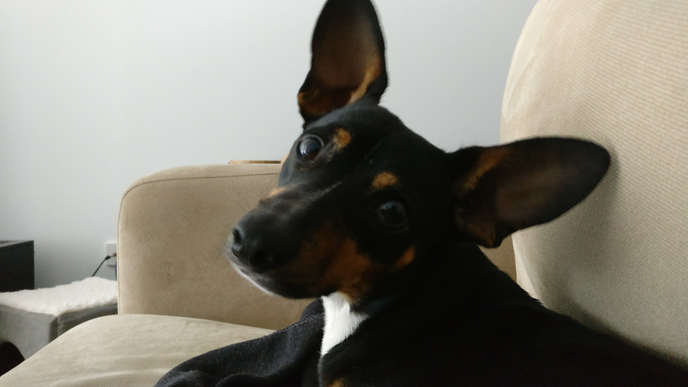
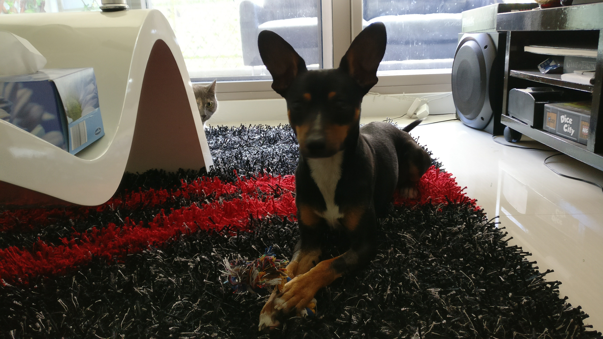

My wife and I have always wanted to have both a cat and a dog. I'm not sure what led us to that dream but we've had or been close to both types of pets before living together, and learned to love the two different personalities they seem to have.

Now, almost a year since we [rescued Fi](https://jaywick.xyz/blog/701/introducing-our-newest-family-member), we were finally able to complete that family portrait we've always had when we adopted this little guy. Meet our latest addition, Pixel!

****

## Breed

Pixel is a mix of Miniture Fox Terrier, Pinscher and some have even thought Kelpie. Originally we were on the look out of Italian Greyhounds, but this guy caught our eye in the adoption page. He was used to cats, social and loved lazying.

Having a dog however was a big change from having a cat. Suddenly we realised how much we took of how independent and low-maintenance Fi had been. She'd clean herself, pee and poop on her own and even sometimes cover it up, she didn't even demand that much attention but loved being next to you. Pixel on the other hand needed to be taken out twice a day to pee and poop, constantly needs love and needs a bath now and then.

While this may seem more stressful, we were well aware of the changes and it doesn't change our appreciation of either creature. The amount of unconditional adoration we get from Pix as well as the crazy amount of obedience he already has makes up for the tiny changes in our lifestyle. Plus it means I get out more, in fact walking in the park is much more fun.

## Fi

Fi initially was super cautious of Pixel. That's just her personality. She took a couple days to step foot on our new rug and used to walk around it or stare it from a corner. We phased them in on the first day by separating them with a fly screen and letting Fi have the control and freedom to get used to someone new. She would glare and twitch at movements but was intensely curious of him. Over time she would stay closer, ever watchful of him and never letting him out of her sight. But just the other day after we caught them licking each others faces twice. Now they chase each other and Pix is good with body language and understands when she's not happy, quickly backing off if shes moved her ears back.

There's also a notable difference in Fi's naughtiness. She used to climb wardrobes, scratch carpet and chew on cardboard. It seems these activities were brought about by being bored and now that she has a play mate, its reduced. She's a year younger to Pixel but its obvious she rules the roost.

## Future

I still need to figure out a way to get them to not each others food. Fi seems to have gained a lot of weight by eating Pixel's food. Sadly the project to make an automatic feeder is still in the back burner but we've installed pet cameras from some cheap Xiomi's but it would be nice to install something that probably isn't keeping the stream on a foreign server.

## Photos
I've made a separate instagram account for Fi and Pixel so I don't keep spam mine with photos of only them, as they are pretty much our life right now. But check it out!

https://instagram.com/fi_and_pixel