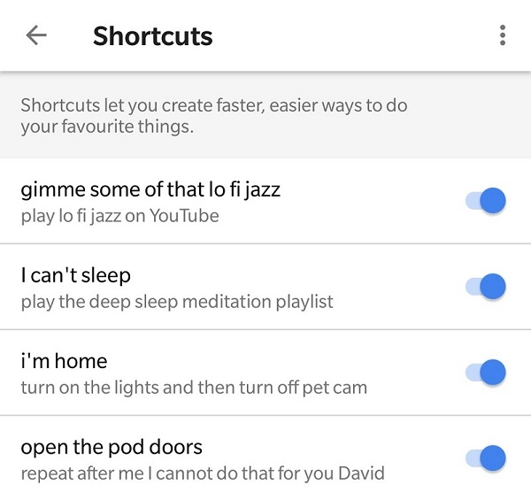
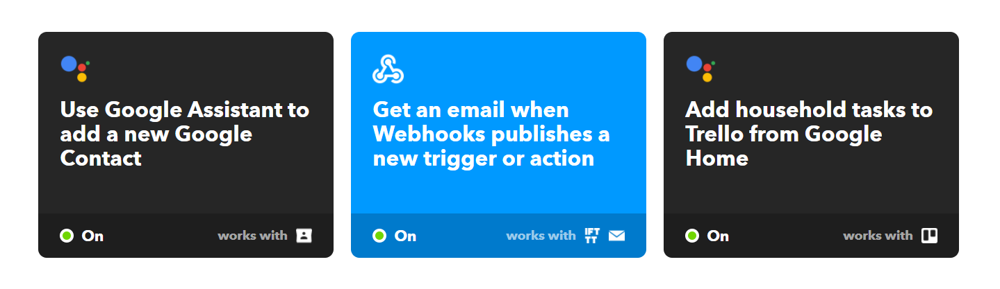
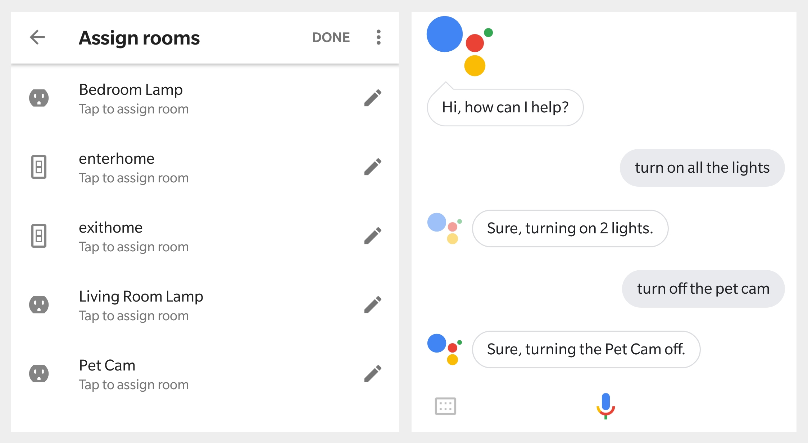

My internal struggle with getting a smart speaker ended when my family bought us a Google Home Mini for Chistmas. All my arguments of privacy and flashbacks of Black Mirror eps suddenly went out the door and I was filled with glee as I was sucked into the ridiculous novelty of smart homes. It was the beginning of the end.

****

## Connectivity

While I only had a Chromecast and an Android Phone to connect with, I was able to easily request YouTube videos and play music. Suddenly I didn't need to find my remote, or even my phone to change the volume. Checking the weather while getting ready was no longer a chore. I was so shocked when I jokingly said "Ok Google, turn off subtitles" and Netflix suddenly got rid of them from the show I was watching. Exploring more into the app, I discovered all the things it could connect with which I did not own. Yet. From smart lighting to robot vacuums the integrations were crazy. Suddenly I had a need to replace every lightbulb and power outlet in the house to be connected to the internet. I wanted Google to know what was in my fridge, if the trains were delayed, if my dog was feeling separation anxiety and if ever it felt free will was an illusion as well. But it couldn't, there were limitations and the magic slowly faded and as with all consumer "AIs" its deterministic responses to simply commands got dull. There was no smirk of TARS, the quirk of C3PO or the intellectual evil of David. But neither was it totally wall gardened, as I was about to find out.

## Customisability 

The inbuilt shortcuts page of the Google Home app provides us with a way to give aliases to commands. Which can be quite useful but it's limited in that it's literally a shortcut for another command, no new functionality is added. That said, I've found myself making shortcuts for common things I ask for.

One of the best integrations yet has to be IFTTT an online service that performs actions given triggers between various services. This paved the way to what I really enjoyed most from my device, personalisation. Where there were no integrations, for example, my wife and I use Trello for managing household tasks and projects, we could configure IFTTT to get Google Assistant to respond to "Add task to Trello saying Find the missing screw to the drawer". For the truly crazy there's even webhook integrations on IFTTT so you could send web requests which opens up a whole new world of possibilities. I half considered linking up Slack so I could let work know I was taking a personal day by saying "Hey Google, I'm sick." but I was swiftly talked out of it.

IFTTT's list of services is quite extensive, and beyond basic single trigger and action "applets", there is the platform which lets you define multiple actions and even a javascript API to filter conditions which I'd recommend checking out regardless of your interest in smart homes. I've yet to play with other integrations but there's [AutoVoice](https://www.xda-developers.com/unlocking-the-true-power-of-google-home-with-autovoice/) for those using Tasker to effectively program their Android phones as well.

In terms of hardware, I recently purchased some cheap Google Home compliant wall switches at a bargain $10/each and loved being able to tell the Home Mini unit to turn off the lights and pet cams. In fact it worked via my phone as well while I was out. But very often it stops working, I'm not sure if the problem is on the vendor or Google Home itself but I'm pretty sure buying cheap hardware had something to do with it. I'm eagerly awaiting [IKEA's smart lighting to reach us in Oz](https://www.lifehacker.com.au/2017/03/ikea-launches-smart-lighting-in-australia/), the current prices per bulb are still subject to *[early adopter tax](https://www.cbsnews.com/news/the-early-adopters-gamble/)*.

## Wishlist

Given that I'm not in the US, there's some stuff I don't have on the Google Home Mini such as calling and texting people. I have yet to find a way to get around this and don't understand why it's disabled. While setting alarms and getting Google to remember your cat's name is kind of cool, I wish it could be invoked without prompts, such as saying "Welcome back" when you came home, or "You missed a call because your phone is on silent" or just a simple "You've got mail!". I can understand the reluctance of the Google Assistant team to try this as people might find it pestering or creepy.

I guess what I'm after is a conversation. To be able to believe in the magic again.

## Privacy

One of my biggest gripes was the need to say "Ok, Google" before giving it commands. But as it turned out this was a good thing for privacy, as anything before saying the hot phrase would not be sent to the cloud. I didn't have to worry about yelling out my credit card number [or other personal information near it](https://twitter.com/xor/status/564356757007261696). It was an OK compromise to not being able to call it Jarvis or HAL. Saying "Hey, Google" also works and flows off the tongue much easier, plus you don't have to worry about being [conditioned to say "OK" to Google](https://www.reddit.com/r/google/comments/41q5vz/does_anyone_else_want_to_change_ok_google_to/cz4x0vd/). None of this changes the fact that Google owns your voice data, and in their buisiness of advertising will use the information we willingly to give other companies more information about us. This isn't new, of course. Data is the biggest resource, and we place a lot of trust in companies to keep our shit safe. Regardless, my arguments of privacy went out the door when I realised how convienent Google had made things, and suddenly I found myself investing in giving them more data about me for things I didn't need before. Ok Google, you win.

### See also

* [/r/googlehome](https://www.reddit.com/r/googlehome/)
* [/r/smarthome](https://reddit.com/smarthome)
* [@internetofshit](https://twitter.com/internetofshit?)
* https://www.lifehacker.com.au/2018/01/here-are-57-things-to-ask-google-home/