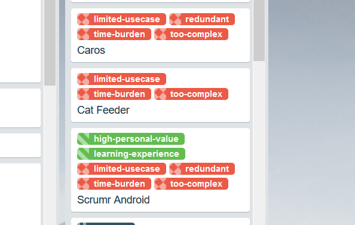

I suck at failing. It's not exactly something they teach you. We're conditioned to be so focused on getting to the finish line that we can take it pretty hard when things don't go to plan. For some, it can discourage them from even trying. Sometimes its more subtle, you spend enough time focusing on what needs to be done that you look back and realise it's not where you wanted to be at all. I had just that feeling and it was probably the closest I got to a quarter-to-third-life crisis.

****

It was New Years Eve 2017, and I sat everyone down to do their new years resolutions by [looking back at the year past](https://www.jaywick.xyz/blog/51/forget-new-years-resolutions-just-answer-these-4-questions). This had always started out as a way to celebrate the wins of last year, promoting the positives and moving away from the negatives. But while thinking about my own accomplishments I paused. I looked back and thought about all the things achieved. We [had a wedding](https://jaywick.xyz/blog/705/wedding-planning-in-the-eyes-of-a-programmer), we got [a dog](https://jaywick.xyz/blog/707/welcome-home-pixel), and it had been an awesome two years since I started living together with Dee. Despite these amazing milestones, I couldn't help but feel this creeping sense of un-accomplishment. I looked then at my personal goals for that year, and came to realise I had none. My personal projects were all over the place, both coding and with life. In retrospect that entire year I had felt like I was rolling with the punches. Hitting the same walls but reacting the same way.

Looking back, all of my personal projects felt like they had flopped big. With the advent of Android Auto, [Caros](https://jaywick.xyz/portfolio/caros) was redundant. There was no point to reinvent a platform, let alone deal with the myriad of hardware problems that really wasn't my interest area. My progress with [Blackstorm](https://jaywick.xyz/portfolio/blackstorm-alpha) had grinded to a halt as well as its complexity grew and I lost interest with optimising and writing a game story. [Open City](https://jaywick.xyz/portfolio/opencity) was becoming complex as well but luckily someone came out with a then-beta of [PocketCity](https://pocketcitygame.com/) born out of the the same spite I had for the status quo of mobile gaming.

These projects alone were not only unsustainable, but I was competing in the wrong league, against teams with orders of magnitude greater skills and resources. And the eventual demise of these projects hit me hard and they accrued my avoidance working on them. Given the enormous expectations I put on myself, the fact these hobby projects became so big and beyond the initial concepts, it was only a matter of time before I crashed.

At the very least I thought, I'd be honest with myself on where they failed and label where had gone wrong. I knew there was a lot of emotion with dealing with failure, I firstly avoided the word and just made a column on Trello called "Done". I then made a list of all the non trivial projects I had built that I no longer worked on. They were done, regardless of how they had ended up. It actually felt good to 'let them go' in a way. I then slowly started categorising the projects, labelling them with common positive and negative attributes. This lead me to see some telling patterns with the projects that had failed, which ranged from being too complex to limited in its use case. Attributes which I could have predicted early without having put in so much investment and emotion, which while fun, wasn't sustainable.

For a short time I felt hesitation starting up new projects, which turned out to actually be a good thing. I added a new column on the board where I would make proposals of ideas. Then tag them with labels so I could prioritise projects better. But this wasn't going to help me avoid the project getting out of hand, or even failing big later down the track.

## The Spark

A couple months later, it was at work that our product manager said something that stuck in my head for a while

> If we aren't failing, we're not experimenting enough

As part of the 'growth team', we ran experiments, developed things that would either be expanded later on or torn down if proven not useful. They ran with a clear hypothesis we were would then validate or disprove with data. It was a hugely different paradigm to get my head around at first, but I really saw its immense value and loved the very data-driven way things were run. There was fewer head scratching at what features were useful, there was data to back our statements, there was visibility in the usefulness of features. And it felt like pure research and development, something I [absolutely adore](https://jaywick.xyz/blog/64/some-more-modelling).

The words of our product manager rang in my head for a few days. Having seen the successes at work with our team process, I was able to draw on what I was doing wrong with my own personal process. If we only did 'safe' experiments that would have been guaranteed to succeed, we would miss out on trying riskier things that could yield more. This meant I had to become not only comfortable with failing, but to embrace its necessity.

The most important bit for me though was that failing was cheap. It was contained and measurable. I thought about work projects of bygone years where a failed project had hurt morale, and sometimes even have people avoid talking about it. Here it was no big deal, almost like saying you didn't like a particular dish you tried at a restaurant. The word failure wasn't even used, we had a clear hypothesis that would either get validated or disproven. When started iterating on experiments it reminded me a lot of those generational algorithms where mutations that benefited a particular set of metrics were kept and negative ones discarded. We were learning, adapting, evolving.

](https://media.giphy.com/media/5dUvvKrf4FGC1O6AVB/giphy.gif)

To improve my personal endeavours I had to reduce the risk and cost of failure. And that was by running experiments. They had to be short lived, a couple weeks of effort. They needed to have clear and achievable goals it would try to achieve. Going back to my Trello board it bridged the gap between 'Proposals' and 'Done'—an Experimenting column.

The interesting thing for me is that when it came to coding projects, I actually spent a lot of time working on interface designs first. If the flow felt off, I could park it and maybe work on something else. And often later on I retried the concept from a different approach. There was no emotion of sunk-cost, I wasn't even failing cheaply at this point, I was just learning. One scary thought I had was that my hobbies would become like work, from having to be my own designer to a mini portfolio manager, but things naturally worked out with me working on things I liked. Designing concepts, building prototypes and getting lost in ideas instead of tripping over myself trying to write a full fledged system.

## The Jump

This kind of thinking was contagious. I began to question everything and see places where I felt avoidance. It crept into other parts of my life and I started experimenting from reading books on going back to the gym with Dee. But it also made me question my career. Where was I going, what did I really want to do? And it was over holidays with family I took the advice of one of my brothers in law about jobs and jumping ship and his advice of looking far ahead and mapping backwards made it clear to me I wasn't deviating from that path. Armed with the once insane notion that failure wasn't such a big deal, I thought I would aim high and apply to somewhere I thought I would definitely not get into yet.

The experiment was to learn as much as possible about the recruitment process and do some recon for future me who would reapply later. I prioritised the bare minimum of what I needed to brush up on, read my go-to interview books and did my homework about the company. And just before the first HR phone call, I did something a little different. I was normally lazy to write notes down after something, but if this were an experiment I had to stick to the process, I would write down where I failed and what I could have done different. But then something strange happened—I made it through. I immediately wrote down what had gone right. As I made it through each round, I altered the process until the final round where I was seeing a horrible pattern of self doubt. Before I went into my final interview, I wrote some prompting questions for post-interview-me, both for the scenarios of success or failure.

I was thrilled when they gave me an offer. I sat on the steps of the old post office building realising I had achieved something big. Fighting my demons by sticking to a process. It was only months ago I freaked out and felt my life being questioned, and before even the middle of the year I had done something impossible. While those close to me, including my boss and peers at work, kept telling me it was because how good I was, it had really been about taming my own demons. I looked back at my debriefs to myself, and my last prompting question "was it as bad as you thought it would be". These series of experiments had opened up my eyes to both continue experimenting in everything I did and look back often, find patterns, promote good ones and find ways to get around the bad. To learn, adapt and evolve as a person.

While I'm not telling you to quit your day job and go do something crazy, but if you're like me and suffer from imposter syndrome or grow avoidance at ever growing complex projects, I suggest try 'experimenting' more. For some this is just called discovering new things, for others it's have the mindset of giving things ago, but at its core its about

* making failure a win by letting it disprove a concept, or be a way to gather more information about something
* have a shorter timeline so failure is cheaper and celebration is sooner
* take notes throughout, before and after, regardless of success or failure, and look back on them often
* repeat it in a different way if you want, or grow on it by doing more experiments on top of what you have now

This blog post funnily enough took over three months to write. And I've been experimenting with new design ideas and projects since then. And yes it is hypocritical of me to tell you to have shorter timelines while I spent forever on this simple update. But for me I needed to get the wording right, I had many rewrites and thousands of words that never made it here. But they needed to exist, for this final copy to come to fruition.

A new experiment I am trying out is to trial blog-driven design and development approach. More on that in a future post!

<ImageCredit
    name="Kasper Rasmussen"
    link="https://unsplash.com/@kaspercph"
/>
