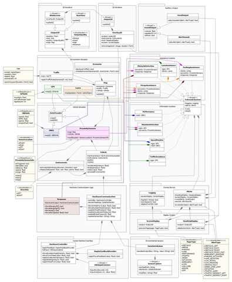

Whilst [working with robots](/blog/72/finally-some-robots-to-develop-on/) this semester, I also worked on a vehicle simulator for another subject as part of a negotiated advanced assignment.

I felt the original project of using WinForms to mockup a vehicle using buttons and textboxes was way too boring, luckily everyone else in the team totally agreed (but that was more likely due to the fact I was making [that other simulator game](/portfolio/blackstorm-alpha/)).

So we went all out and designed a proper simulator system. And we were *only* 150 pages over the page limit!

****

In fact I found myself wondering how to even print some designs on an A4 page. Don't let the class diagram below scare you, because you should really have seen the activity and sequence diagrams for each interaction in the system and our 150 pages over the limit.

 [Watch this project](/portfolio/vts) for more updates!