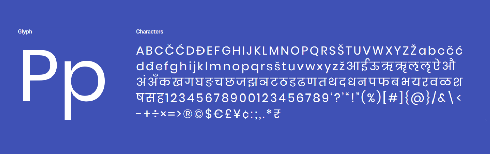
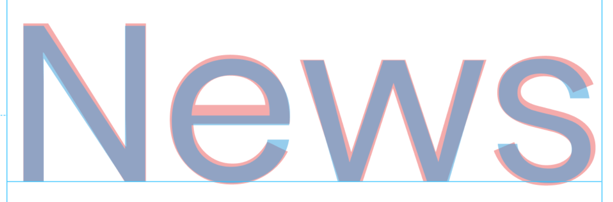
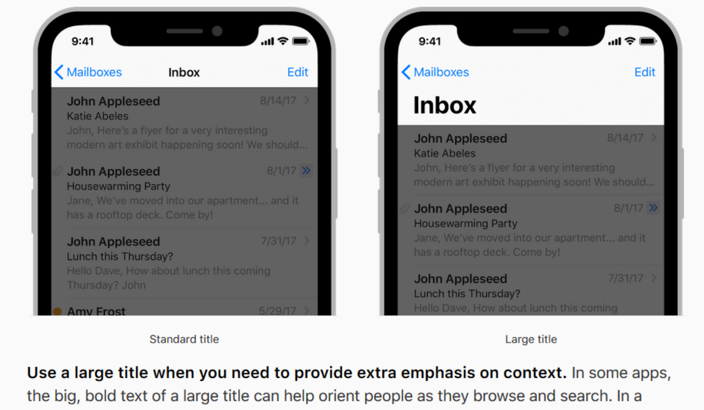
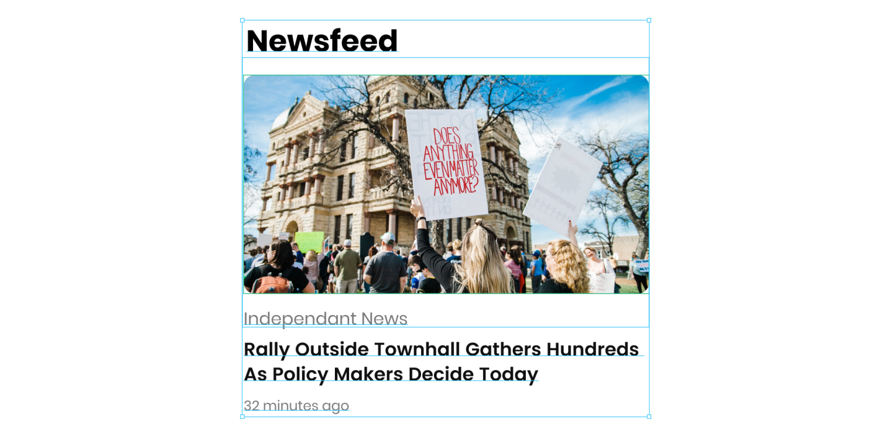
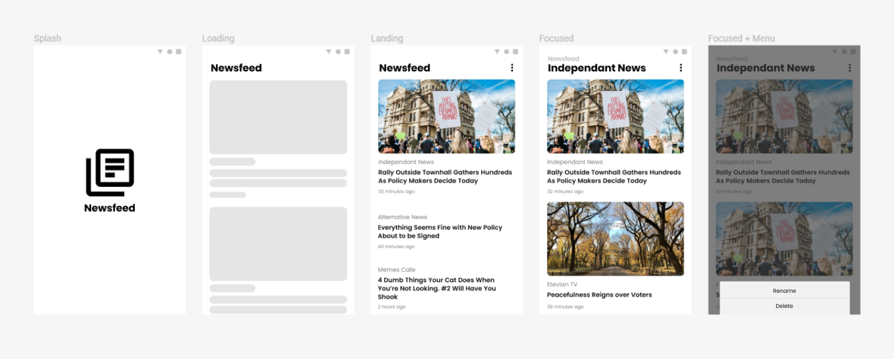

In the spirit of [experimenting all the things](https://jaywick.xyz/blog/709/how-i-learnt-to-fail-better) and a [personal yearly goal](https://jaywick.xyz/blog/51/forget-new-years-resolutions-just-answer-these-4-questions) of focusing more on designs, I started work on a new project! Mixed with the frustrations I had with using the new Google News app, but harbouring a love for its aesthetic, it was a great excuse to get back into mobile development.


****


##  Geometric fonts

In early 2015 google showcased their new font [Product Sans](https://thenextweb.com/google/2015/09/01/google-created-an-entirely-new-typeface-for-its-snappy-logo-redesign/). A beautiful rounded font that shifted my love from humanist and neo-grotesque to [geometric fonts](https://en.wikipedia.org/wiki/Sans-serif#Geometric). Geometric fonts aren't anything new, you might have run into [Circular](https://fontsinuse.com/typefaces/31411/ll-circular) which Airbnb once used, or [Futura](https://idsgn.org/posts/know-your-type-futura/) which IKEA had before Verdana. [Century Gothic](https://www.fonts.com/font/monotype/century-gothic) was another that was pre-packaged on Windows machines. The new typeface was to represent the Google brand, and thus, it was never open sourced, despite its usage all across their web sites and apps. Much to the dismay of UI tweakers like myself. I had to find something close to match my app.

Finding fonts on the web can be both fun and horrible. If you're into typography like me, it's fun to learn the history of a typeface, it's interesting to understand the context from which they were made and what perception they are trying to achieve. Now the licensing and usage fees are where it gets hairy and often being a dead end. Which is why I was so excited to have found a font that ticked all the boxes.

Meet [Poppins](https://fonts.google.com/specimen/Poppins) by [Indian Type Foundry](https://www.indiantypefoundry.com/). A beautiful rounded and well bolded type which captured what I liked about Product Sans. It wasn't a blatant clone either, it had its own identity. Oh and it had a very generous [OFL](https://scripts.sil.org/OFL_web) license and was even hosted by the [Google Fonts directory](https://fonts.google.com/).




Comparing the two (Poppins in blue, Product Sans in red) you can see how similar the individual letters are. Note that in this comparison I *did* condense the letter spacing of Poppins to match.





## Material 2

Google New's UI is a major departure from the original Material Design v1 spec. It feels [cleaner, simpler, has more rounded corners](https://9to5google.com/2018/04/26/what-is-material-design-2-examples-launch-io/) and the new Product Sans font really captured the branding. In fact a lot of Google apps are being redesigned to follow the new look. The rounded corners took me a while to get used to, throughout the UI refreshes you would see, from [Gmail](https://www.theverge.com/2018/4/25/17277360/gmail-redesign-live-features-google-update) to even the [Chrome tabs and search box](https://blog.google/products/chrome/redesigning-chrome-interview-chromes-lead-designer/).

Given the entire goal of this new iteration of Material design was to [provide guidelines, not enforce rules](https://uxdesign.cc/previewing-material-design-2-0-ec0215f0588f#b290) allowed apps to have their own unique style, I was free to evolve the look. I had the new card design of the Google News app but wanted to borrow elements from other places that made sense. One pattern from newer iOS layouts that I liked was the use of a large title to emphasise the context of where the user was.




It was in fact very reminiscent of the large titled metro UI from the Zune for me, and the more accessibility friendly [Fluent Design](https://www.theverge.com/2017/5/11/15615812/microsoft-fluent-design-system-project-neon-features), which was nice to see coming back. Some other patterns I looked at were action sheets over menus, fluid animations between screens and shimmer effects on placeholders. For the actual designs, I opted to use Figma, which was free but was still really powerful. It was good to move away from the Mac only Sketch and have online collaboration as an option if I needed it. And after meticulously aligning every element, the base card design was coming together.




## Status quo

A lot of my development projects had been brought about by annoyance of the status quo, even if it meant embarking on ridiculously complex projects like [Blackstorm](https://jaywick.xyz/blog/tag/blackstorm-alpha) or [Open City](https://jaywick.xyz/portfolio/opencity). This time I wasn't going to try and build a full fledged app, but to prototype a concept.

My biggest issue with the Google News app was that it was difficult to choose your own sources. The app chooses common news sources based on your location and gathers sites its algorithms decided you might be interested in. It did however let you manually choose topics in the form of saved searches which was cumbersome to reach and always seemed to have old content. Boy did I miss the days of Google Reader. Social media sharing like Twitter and Facebook wasn't in anyway how I wanted to get my news for various reason. And I tried many [Feedly](https://www.wired.com/story/rss-readers-feedly-inoreader-old-reader/) clients but they all at the time felt like an ever growing inbox and they never really felt that nice to use.


## Implementation

Now it was time to implement the designs. In every native Android project I had worked on, working with the UI was far too cumbersome, I had spent more time modelling UI patterns like data binding than I did implementing the interface. The very proprietary feel of [NativeScript](https://www.nativescript.org/) when I last used it had left a bad taste in my mouth and I didn't want to install the full fledged Visual Studio on my machine again to set up [Xamarin](https://visualstudio.microsoft.com/xamarin/). React Native looked the most appealing. It was actively developed and had an extremely fast dev loop thanks to [Expo](https://facebook.github.io/react-native/docs/getting-started.html), and I had more experience in its patterns and paradigms than the other options such as [Flutter](https://flutter.io/).


Without too much mucking about, the single card component ended up pretty much consistently looking like this

```jsx
export const Card = ({ thumbnail, source, sourceUrl, title, date, link, onSourceClicked}) => (
    <TouchableNativeFeedback onPress={handlePress(link)}>
        <View style={styles.container}>
            {
                thumbnail ? (
                    <Image
                        style={styles.image}
                        borderRadius={10}
                        resizeMode='cover'
                        source={{ uri: thumbnail }}
                    />
                ) : undefined
            }
            <TouchableOpacity onPress={handleSourceClick(sourceUrl, onSourceClicked)}>
                <Text style={styles.source}>
                    {source}
                </Text>
            </TouchableOpacity>
            <Text style={styles.headline}>{title}</Text>
            <Text style={styles.date}>
                {distanceInWordsToNow(date)}
            </Text>
        </View>
    </TouchableNativeFeedback>
)
```


Hardcoding the RSS feed's location for some regular sites I would frequent,  and some trial and error finding a common pattern in how websites actually implemented the RSS spec, the code settled to form something similar to the following (defensive checks and error handling removed for brevity). I wanted the app to be super light for fast startup so I opted to use my naive parsing techniques over using a pre-existing library like [react-native-rss-paser](https://www.npmjs.com/package/react-native-rss-parser). My initial naive implementation wasn't that bad, it picked up most of my favourite sites but we'll see how it handles others as I get some beta testers for this!

```javascript
getNewsFeed(sources) {
	return Promise
        .all(sources.map(fetchStoriesForSource))
        .then(flatMap)
        .then(sortByDate)
}

fetchStoriesForSource(url) {
    return fetch(url)
    	.then(response => response.text())
    	.then(xmlToJson)
    	.then(mapToCardModels)
}

mapToCardsModel(rssRootObj) {
    return rssRootObj.rss.channel[0].item
        .map(item => ({
            thumbnail: getThumbnail(item),
            source: rssRootObj.rss.channel[0].title,
            title: item.title[0],
            date: item.pubDate[0],
            link: item.link[0],
            sourceUrl: url,
    	})
}
```


## Tangents

As the ~~project~~ experiment grew, I actually ended up getting bogged down adding a library screen to manage the sources. But sticking with my guidelines on running experiments, I had to go back to what was more important for me. This ended up with me tearing down the code for preferences, but in losing that customisability, the business logic became much simpler and I was able to iterate faster. Jumping between designs and code I felt an odd feeling of 'oh hey, I'm actually finished this experiment'!





Once I figure out _how_ to actually manage app preferences without spending forever on it, I will throw this on the Google Play Store for evaluation!
