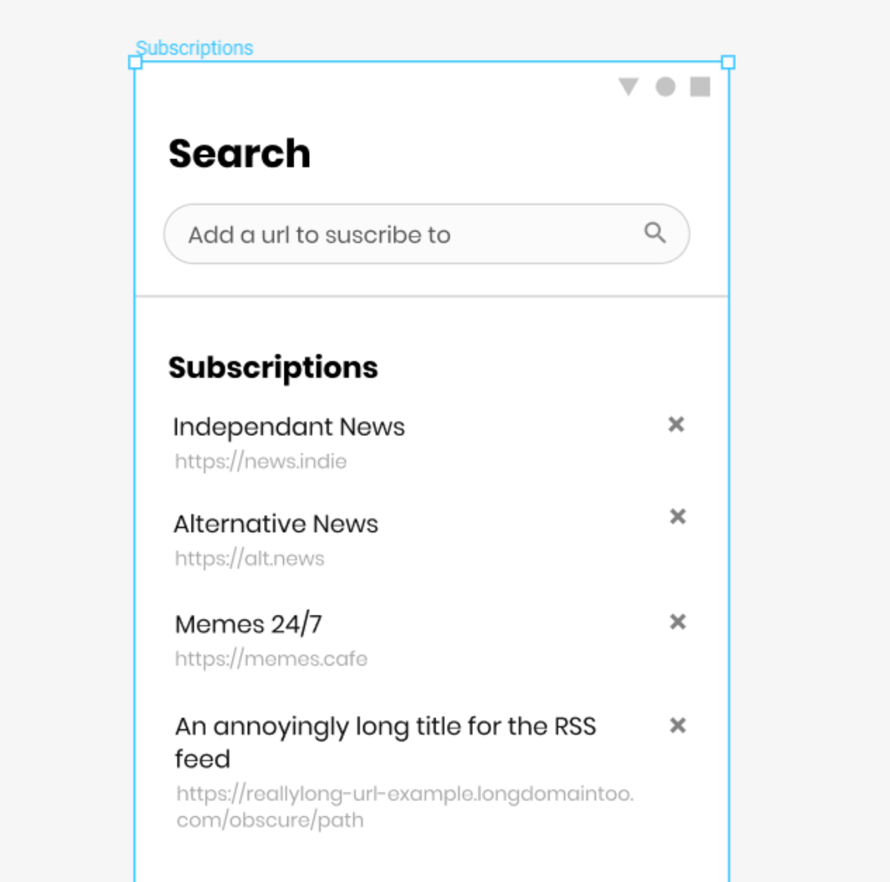
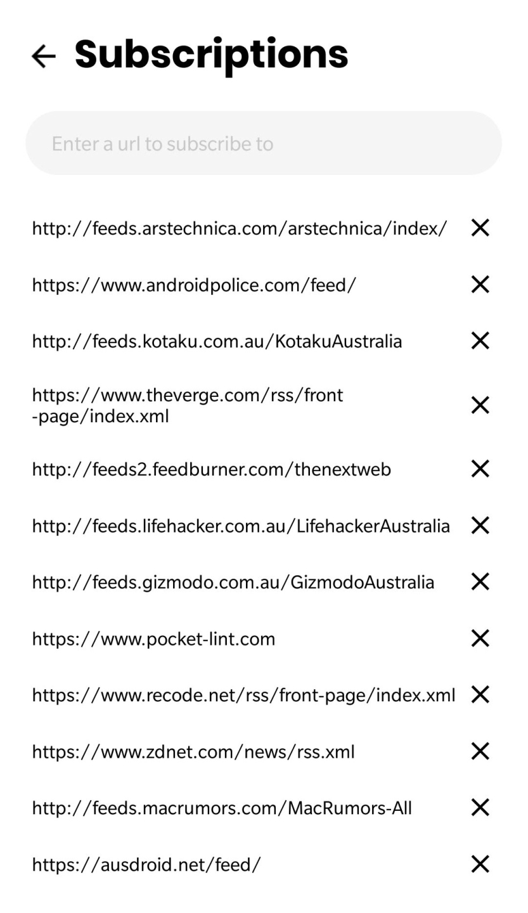
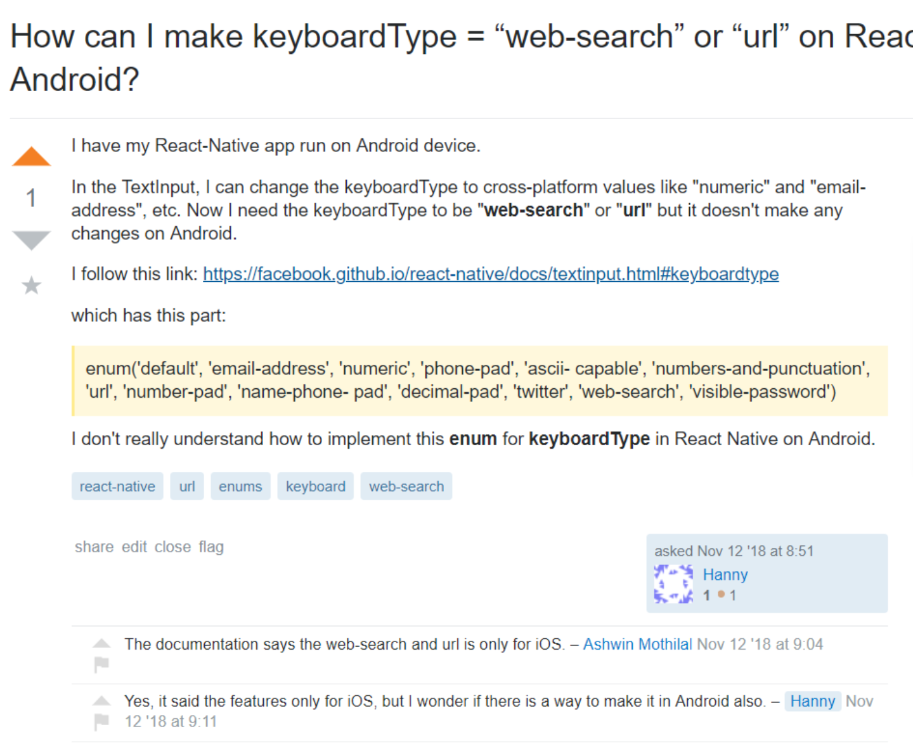

A couple months ago [I blogged about](https://jaywick.xyz/blog/710/newsfeed-concept) starting a project called *Newsfeed*. After six months of coding during my commute to and from work, I finally released a beta to the Google Play store just this weekend!

****

*Not much of a reader?*

Just wanna download and try it out? Sure, go nuts! - [Newsfeed via Google Play Store](https://play.google.com/store/apps/details?id=xyz.jaywick.labs.newsfeed)

Newsfeed was born from my dislike of relying on social networks like Reddit or Twitter for news. There were too many distractions, spammy content and irrelevant ads and recommendations. I loved the new look of Google News but it never surfaced my chosen sites properly. I knew the sites I liked. I just wanted to see their headlines, no signing up, no background downloads, no god-awful unread count making it a chore to keep up. Something a bit nicer for my digital wellbeing, but something that still catered for my need for an information fix.

## The real MVP

Recently I started applying the concepts of running my projects as [experiments](https://jaywick.xyz/blog/709/how-i-learnt-to-fail-better), This involved prioritising the most important work I needed to do to get to a prototype and then next a minimum viable product. This meant fighting real hard against perfectionism and my wanting to implement all-the-things. Luckily I was able to keep my divergent thoughts to concepting on [Figma](https://www.figma.com) before losing time on implementing something that didn't *feel right*. But how do you decide what's good enough and what's too much?

Concepts such as [Minimum Loveable Product](https://labs.sogeti.com/the-minimum-lovable-product/) aim to answer this, but for me, it was enough to communicate my intent and thus manage expectations. This was a beta, a one person team doing this as a hobby. It would grow, but don't expect API integrations with your favourite services or a daily edited "editors pick" discovery section. Newsfeed had one purpose, to fulfil its hypothesis

> Deliver news from sources you choose with little distraction <cite>the Newsfeed hypothesis</cite>

Depending on how people used it, I could prioritise my time into feature delivery. But that needed data which is the value of the beta. Most importantly once it was released I could make small changes on it to continually improve it.

> To improve is to change; to be perfect is to change often <cite>Winston Churchil</cite>

## Other designs

I had lots of ideas, a lot. From Reddit and Twitter integration to simply a nicer UI on the subscription screen, I mocked up the idea but let it remain there without pursuing it. Implementing a feature adds complexity, and can compromise your existing features and flow. Sometimes I would implement something but realise only later it was causing problems I hadn't anticipated. It was theraputic removing code, knowing I was reducing complexity. And at the very least they would live out as designs despite never making it to fruition.

One feature I trouble letting go of was designing and redesigning the Search/Subscription page. What originally started out as a tabbed interface with a separate Search and Library page, eventually merged together for simplicity but I was never happy with the designs. I borrowed designs from various apps but the closest I came to something I was happy with was the design below.

These redesigns and reimplementations were not at no cost, I was letting *perfect be the enemy in the way of good*. And in the end I shipped with something utilitarian that could be improved on incrementally.

Other things that I knew were future work, I added to a blank GitHub repo just to track issues. And added my own feature suggestions that people could potentially vote on.

## Developer experience

I had opted for Facebook's [React Native](https://facebook.github.io/react-native/) to implement the app because I wanted to focus more on improving my JavaScript. I used a few libraries that I wanted more experience in such as Redux, Redux Thunk and Lodash, as well and setting up build and test tools like Storybooks, Jest and Typescript, which at most workplaces get set up by someone earlier.

The [Expo](https://expo.io/) framework proved monumentally useful in debugging and developing Newsfeed. The tooling was excellent and wirelessly testing on my phone was something that had been difficult to set up when I had last tried my hand at Android development years earlier.

But there were caveats. Lots of gotchas. Despite being touted as a write once, deploy everywhere I found myself having to implement or import what would be basics in native development. Where were the Android menus? What about alerts and prompts? And why did storybooks keep never return to the last selected story on refresh? Wait what do you mean only iOS supports URL type input fields?

Let's not even mention the odd build errors on Expo you'd get, some times publishing didn't even work. This really dampened my spirits as the tooling and framework felt like it was not yet mature. A lot of these tiny annoyances began to compromise the feel and flow, not just the functionality. Something I had thought was meant to be easier by circumnavigating native development.

Don't get me wrong. I'm not hating on Expo or React Native. They're amazing. But it was slowly feeling like mobile development just wasn't for me. Regardless, I'm excited to see the future of these tools as they grow and look forward to giving it a go again!

## All in all

Despite the friction, I learnt a lot and had heaps of fun. And I constantly use the app myself when taking a break. It's achieved the goal of replacing social media brilliantly while giving my brain its information fix.

For up coming few projects, I might go back to [Electron](https://electronjs.org/) or perhaps even check out [PWAs](https://medium.com/dailyjs/goodbye-electron-hello-desktop-pwas-f316b8f39882).

***[Update 2019-07-19]:** Or maybe even [TWAs](https://medium.com/@firt/google-play-store-now-open-for-progressive-web-apps-ec6f3c6ff3cc).*

So yeah, check out the app if you're into RSS!

[Newsfeed via Google Play Store](https://play.google.com/store/apps/details?id=xyz.jaywick.labs.newsfeed)

And make sure to leave behind feedback at the [issues page](https://github.com/jaywick/newsfeed-issues/issues)!
