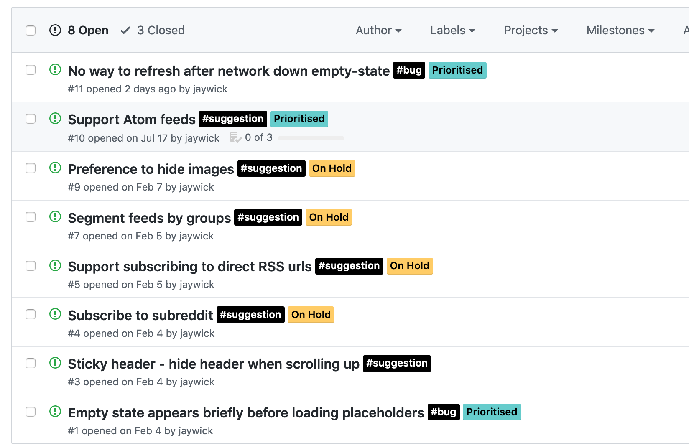

Coding was a hobby before it became a way to pay the bills. I was always motivated to make something that was missing or to replace something that was a shitty experience to use. That’s pretty much how [Newsfeed was conceived](https://jaywick.xyz/blog/710/newsfeed-concept). But some time [after publishing to Google Play Store](https://jaywick.xyz/blog/711/newsfeed-beta-now-live) and keeping track of friction I encountered with the app myself, there was one that just had to be prioritised for me—making it easier to use the app at night.

---

## Dark mode all the things!

Dark mode has become seemingly more popular in user interfaces these days. Dark themes were my [go to for code editing](https://www.hanselman.com/blog/ChangingYourColorsInVisualStudioNETBlackVersusWhite.aspx), but now it’s found its way into mainstream use like [YouTube](https://www.techadvisor.co.uk/how-to/social-networks/how-enable-youtube-dark-mode-3686439/), [Android 10](https://developer.android.com/guide/topics/ui/look-and-feel/darktheme), [Mac OS](https://support.apple.com/en-us/HT208976) and even the [old Windows File Explorer](https://blogs.windows.com/windowsexperience/2019/04/01/windows-10-tip-dark-theme-in-file-explorer/).

There’s even a [new CSS media feature](https://developer.mozilla.org/en-US/docs/Web/CSS/@media/prefers-color-scheme) `prefers-color-scheme` drafted so that websites can switch to a dark theme if the user has set this at their Operating System level. This is great for when your computer is themed all dark and opening a web page no longer blinds your eyes, but it’s up to the web developer to use, so until then there’s still third-party extensions like [Dark Reader for Firefox](https://addons.mozilla.org/en-US/firefox/addon/darkreader/) or [Chrome](https://chrome.google.com/webstore/detail/dark-reader/eimadpbcbfnmbkopoojfekhnkhdbieeh?hl=en).

Now while dark mode is great for someone like me, with glasses mitigating eyesight issues and working mostly in the dark, this isn't for everyone. Whether its personal preference or differences in eyesight, light themes still have their place, so its important to be inclusive and provide the choice.

## Designs

Without touching a single line of code, I fired up Figma and added a mock up of dark mode along with the other crazy future ideas I was investigating.

> That looks easy to implement, just change some colours right? <cite>Internal pointy-haired boss voice</cite>

Well sure, but we want dark mode to be a choice… So we need to make a settings page… And we obviously need a way to get to that settings page… So we need a navigation pattern… 🤔

## Navigation bar

Nav bars have been a thing in iOS for ages, but only became ‘standardised’ in the [second iteration of Material Design](https://material.io/components/bottom-navigation/) in the Android world, having originally prioritised swipable “drawers” hidden behind hamburger menus. Navigation bars at the bottom of the screen are incredibly useful, they’re much more ergonomic fitting perfectly within the [Natural Thumb Zone](https://www.scotthurff.com/posts/how-to-design-for-thumbs-in-the-era-of-huge-screens/) and giving situational awareness of where you are, and where you can go.

## Settings page

Ok so this was pretty simple, just add a new screen and when navigation goes to settings we conditionally show it. [Expo’s AsyncStorage](https://docs.expo.io/versions/latest/react-native/asyncstorage/) made storing settings insanely simple. It was also a great place to put links to things like image credits without cluttering the main screen.

## What else is new?

* Made a dark variant of the icon and dark splash screen the default. Unfortunately there was no way to personalise that. My thinking was that a dark splash with a light themed app would cause less friction than someone expecting dark theme who would be be blinded by a white splash initially. Compromises right? 😔

* Added some illustrations from the amazing [Icons8](https://icons8.com/ouch) for empty states like when there’s no network or no subscriptions

* Added a long press shortcut to share links

## Roadmap

I was able to better organise my ideas and bugs I ran into in the [public issue tracker](https://github.com/jaywick/newsfeed-issues/issues), and one item that stood out that wasn’t blocked by anything else that I wanted to pursue next was supporting subscribing to [Atom feeds](https://en.wikipedia.org/wiki/Atom_(Web_standard)#Example_of_an_Atom_1.0_feed). Right now Newsfeed only subscribes to [plain RSS](https://en.wikipedia.org/wiki/RSS#Example).

So checkout [Newsfeed on Google Play](https://play.google.com/store/apps/details?id=xyz.jaywick.labs.newsfeed), it’s free, no IAP, no ads – and leave your [feedback here](https://github.com/jaywick/newsfeed-issues/issues)!

## Engineering Changes

Under the hood, a lot changed in terms of state management. I was using Redux and its boilerplate was becoming a little tedious for my liking. At the same time, at work they announced an in-house state management library, [react-sweet-state](https://github.com/atlassian/react-sweet-state) which was meant to take the good parts from Redux and yet be more nicer to use. What better way to experiment with this than on a personal project?

My reasons to move away will be totally different to someone else’s, but my reasoning was pretty rudimentary

* I wanted to try it out on a tiny non mission-critical hobby project

* Learn more about react-sweet-state as we’re using it at work

* Action and const name scheme of Redux was annoying to navigate between, sweet-state was much nicer to use with Typescript’s autocompletion and jumping between definitions and usages

* Being told it works with React Dev Tools, I haven’t tried this yet myself though, but that’s a big selling point

* Easy to use with react hooks, or context providers if you’re not on the latest React version yet

* Plays nice with async actions out the box, no `redux-thunk` needed

* Genuinely felt easy to pick up. But then again I had knowledge from Redux, so take that with a grain of salt

I would recommend giving it a try if you have any 20% or hackathon time though, and will blog more about it the more I use!
