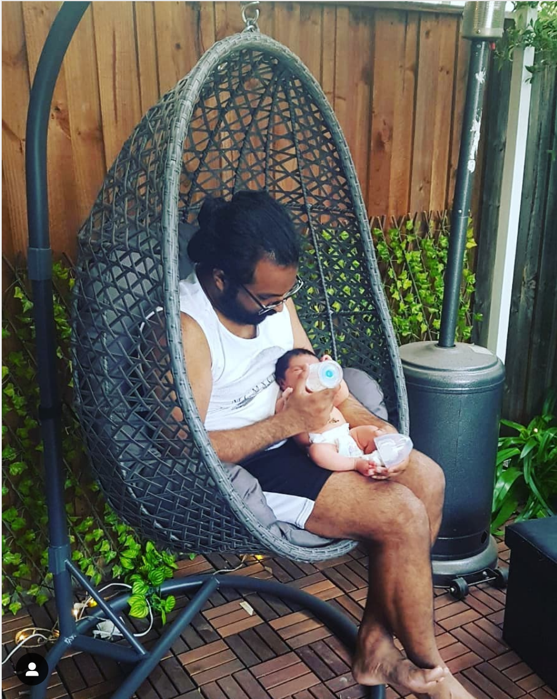
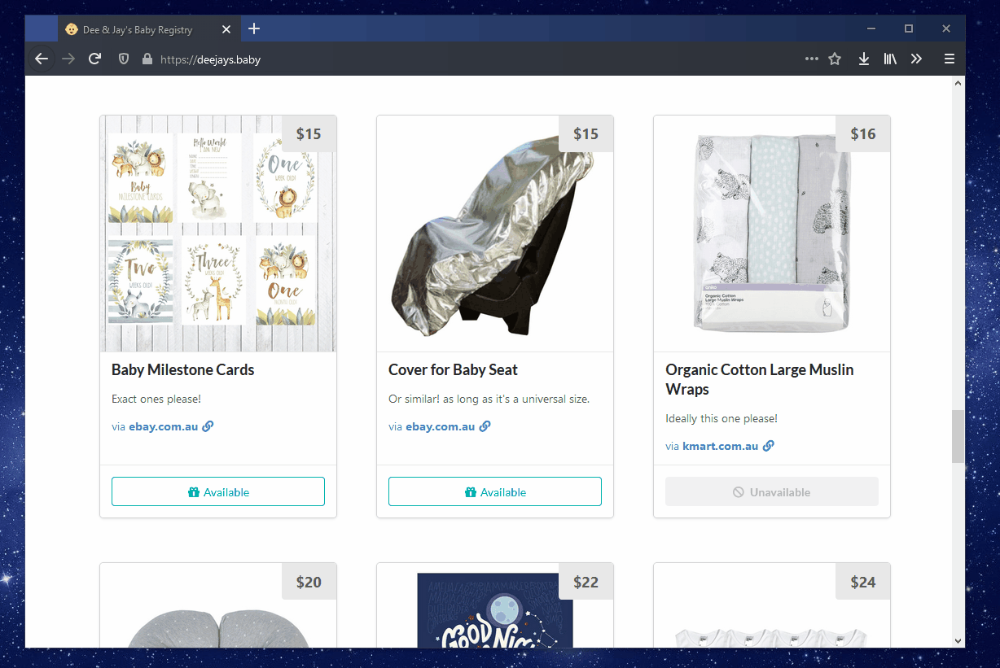
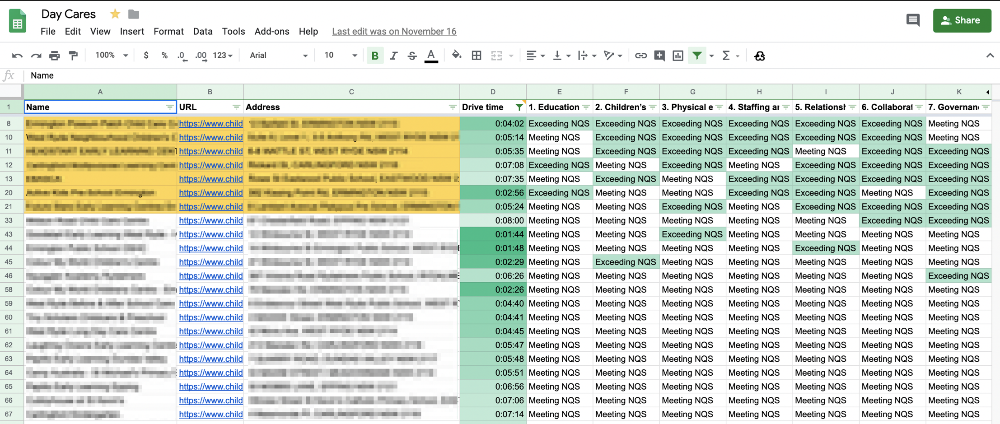

A month and a half ago, my wife delivered our adorable blob of a daughter into this world. It's been a chaotic but amazing time, and now that I'm back at work I've had some time to reflect on my time off on paternity leave.

***

## How it went

Absolutely nothing prepares you for how a newborn affects your sleep. It's not about always feeling sleepy, [something I am expert at](https://twitter.com/jay_wick/status/993987257441779712), it was so much more than that.

Having to tend to our newborn every two to three hours, we quickly found it was the lack of uninterrupted sleep that pushed us into a limbo state between being asleep and awake. There were no longer days or nights, instead existence flowed as a stream of 2-3 hour cycles. Slowly we lost track of time and reality, things that happened that very morning could feel like it had been days ago.

It was all trial and error, a lot of learning as you went. As patterns seemed to become predictable, baby would change her routine entirely. We learned to be quick to adapt, be patient and understanding not just with baby but with each other. Two things that helped us the most were 

1. 💂‍♀️ **Taking shifts**, so the other one of us could get some uninterrupted sleep. We luckily had each other, friends and family who could look after baby while one of us could get some much needed deep sleep.
2. 🤹‍♂️ **Learning to multitask** was something I had no choice but to learn. There was was never enough time in the day to do things—from using a baby carrier while getting chores done, to watching Netflix waiting for her to burp and keeping her upright so she didn't vom it back out.

It's funny because it was only at the beginning of last year I went through a catharsis on [how much I sucked at failing](https://jaywick.xyz/blog/709/how-i-learnt-to-fail-better), and made significant changes to my outlook and routine. The last couple of weeks put me to the test, and I feel I've grown so much more despite the chaos. Something about having a kid switched something in my mind, it was like a new perspective on life, things that would affect my mood negatively like situations with work or family seemed to hold little weight. My mind was focused on the baby and so long as she was healthy, nothing else mattered.

## Preparing for a baby

Unless you've practiced being on-call with a Tamagotchi wired up to page you every 2–3 hours for a month or two, there's no real way to prepare for a newborn. What you can do however is research for some great-value purchases.

We scoured through [Choice](https://www.choice.com.au/babies-and-kids), [Canstar Blue](https://www.canstarblue.com.au/family-gifts/), [ProductReviews](https://www.productreview.com.au/c/babies-kids) and other baby specific review sites to compare between the infinitude of things to buy. The important thing was to differentiate what was a necessity and what we could live without. To avoid people gifting us clothes which baby would quickly outgrow, we set up a registry. For me, that meant having an excuse to spin up a new web app like [I had for our wedding RSVPs](https://jaywick.xyz/blog/705/wedding-planning-in-the-eyes-of-a-programmer)!

The most notable purchases we made that were of great value were

- [Aldi Nappies and Wipes](https://www.aldi.com.au/en/groceries/baby/nappies-and-wipes/)
- [Armstrong Baby Bathtub](http://rogerarmstrong.com.au/products/display.asp?ID=639&Title=Roger%20Armstrong%20Flat%20Fold%20Bath%20-%20Grey&Category=Bathtime&Brand=) via an Aldi special
- [Ubbi Diaper Pail](https://ubbiworld.com/pages/diaper-pail)
- [Mother's Choice Haven Stroller](https://www.motherschoice.com.au/strollers/4-wheel/haven-4-wheel-stroller) from Big W
- [Bassinet](https://www.kmart.com.au/product/bassinet/2310819), [wraps and simple clothes](https://www.kmart.com.au/category/kids-&-baby/baby/shop-all-baby-&-nursery/413033) from Kmart
- [Changing table](https://www.ikea.com/au/en/catalog/products/60372219/) with [baskets](https://www.ikea.com/au/en/catalog/products/10199284/) from IKEA
- [Diaper bag](https://www.wish.com/search/baby-bags/product/5b15f3da978bdd7decb6a7ba?&source=search) from Wish
- [Munchkin Latch](https://au.munchkin.com/bottles/latch.html) bottles

A notable purchase that was expensive, not really necessary, but made sense for us was the [Lollipop Baby Camera](https://www.lollipop.camera/). It's basically a baby monitor with video display you could use with a smart phone. This was something my wife's mum and sister, who live out-of-state, could log into at night and check up on baby. It had an audio monitor mode you could keep running in the background from your phone as well which proved useful. But this one deserves a vlog of its own at some point.

## Support and Leave

As mentioned earlier, having support is incredibly helpful. That old saying made so much more sense now

> It takes a village to raise a child <cite>old African proverb</cite>

Whether it's your partner, friends, family, kind strangers or even qualified professionals—having someone to take the reins while you take care of others, chores and most importantly yourself, is really useful. Take any help you can get. We were privileged of not only having an incredibly supportive friends and family, but employers who understood the importance of both our time with our new child.

My wife had the opportunity to ask for a year off from work so as to bond more with baby as she grew. This included three months of fully paid maternity leave and the remainder on no-pay. But a guaranteed position back to what she did before, or close to it. On my end, as the secondary carer I was entitled six weeks of paternity leave, with the option of taking another fourteen when my wife goes back to work within a year. This was one of the many reasons I've found a home working at [Atlassian](https://www.atlassian.com/company/careers).

## Looking ahead

We can't wait to see how Rory grows. She's already outgrowing her current set of clothes and there's new things to research and buy on the horizon! There's also day cares to look for, which might seem early to look up, but after hours of searching I thought I found the perfect centre, only to realise it had a **two year** waiting period.

So naturally I started extracting and merging data from various sources so I could make a much more informed decision!

Stay tuned for a whole lot of more updates. _When I get the time that is!_