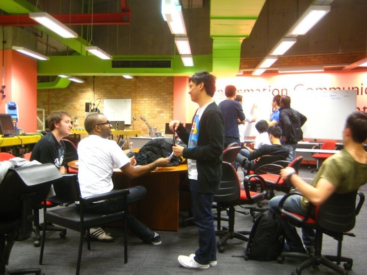
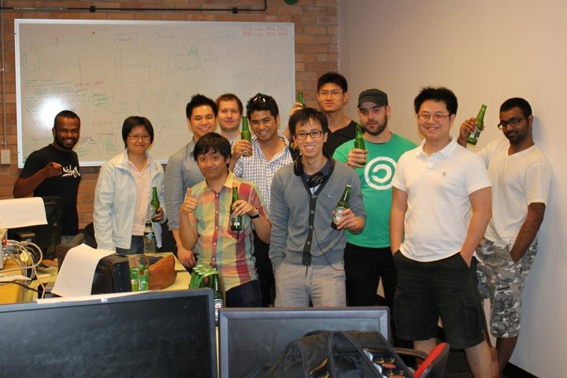
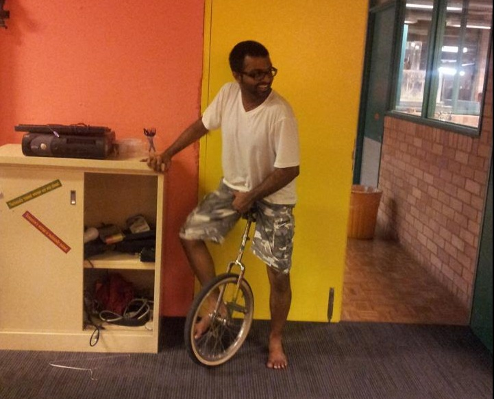
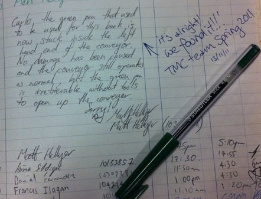

<YouTube id='XlmzMzcTRU8'/>

I have to say working on this project was heaps fun. Sleeping overnight in the lab, the wonders of integration testing, deadlocks, livelocks, and best of all robot arms going wild and trying to kill our team members.

We eventually managed to tame the beast. And finally at 2AM on the due date we did a full run. Check out the featured video. It's a bit long, so you might want to skip through.

So what are we seeing here?

****

1.  Loader robot places a tray onto a conveyor 
2.  Conveyor moves tray to Assembler robot 
3.  Assembler puts together a load-out 
4.  The placement (of poker chips) is then checked by the camera 
5.  Loader returns the tray to the rack 

Behind the scenes, the brains of the operation is a Supervisory system which represented half the code. All this took a 12 people crew, 2 weeks and 14,581 lines of code.

You can see our final presentation at [http://youtu.be/XNMaHoGQO2E](http://youtu.be/XNMaHoGQO2E). But let me spoil it for you, it worked good. Demonstrated before 40 people and with no manual operations involved.

A special thanks to Chris (5th from left) and [Ro](http://andrewsario.com/) (6th), fellow members of *Team Robot*, and [Dom](http://typedom.net/) *(checkered shirt)* our Project Manager.

And here’s a picture of me on a unicycle.

We found more random things, the more we started living in the lab. Skeletons, lawn bowls, torture tools and a green pen stuck *inside* the conveyor since mid 2010 which had once been used to sign the visitor log.

You know you’re teams pretty good when at the end of the subject every one of them is on your Facebook.