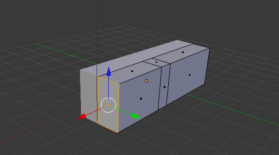
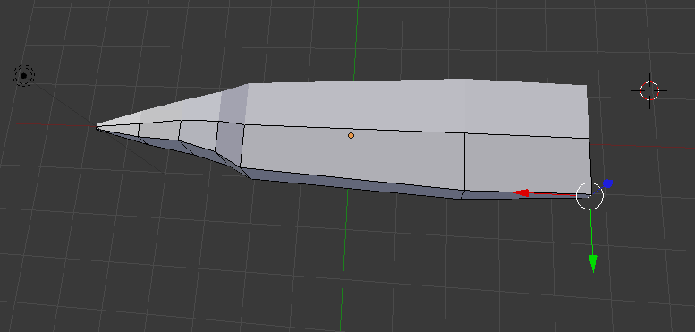
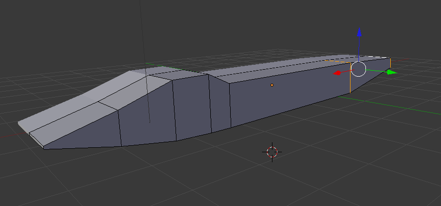
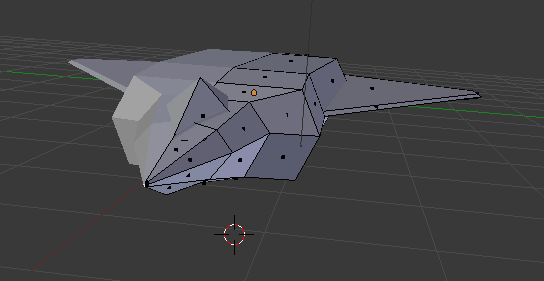
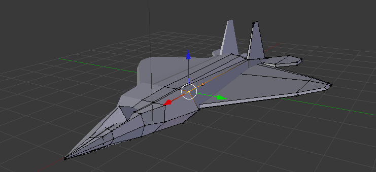
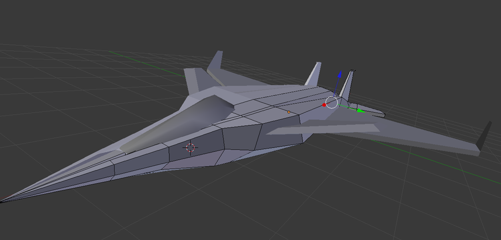
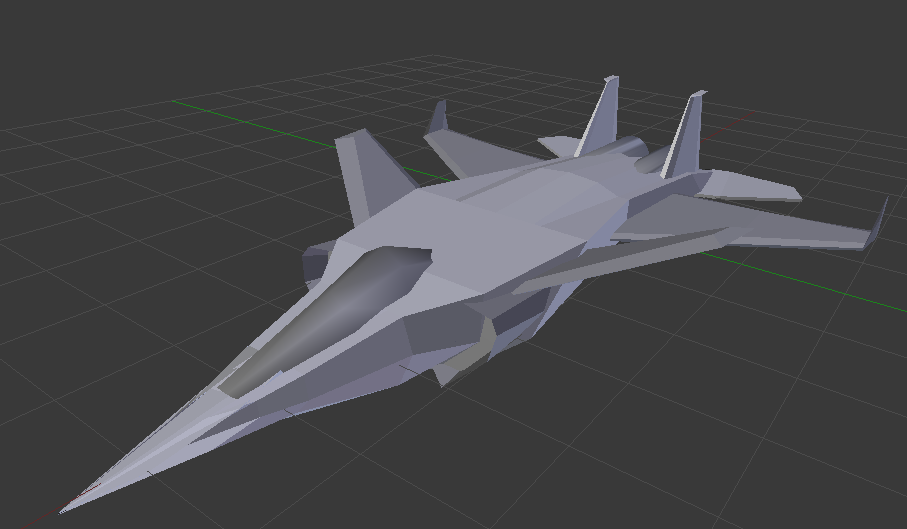

I couldn't sit around all day and use other people’s models for the [flight game](/portfolio/blackstorm-alpha). So I set about learning how to make my own.

Here's some pictures of the modelling process. Although [Blender](https://www.blender.org/) has a ridiculous learning curve and more shortcuts than every permutation of combinations a keyboard allows, once you get the hang of it, it just gets way too fun.

****

And the final product of 3 hours of tweaking each point on every axis.

I shall call it, ***The Variant***.

