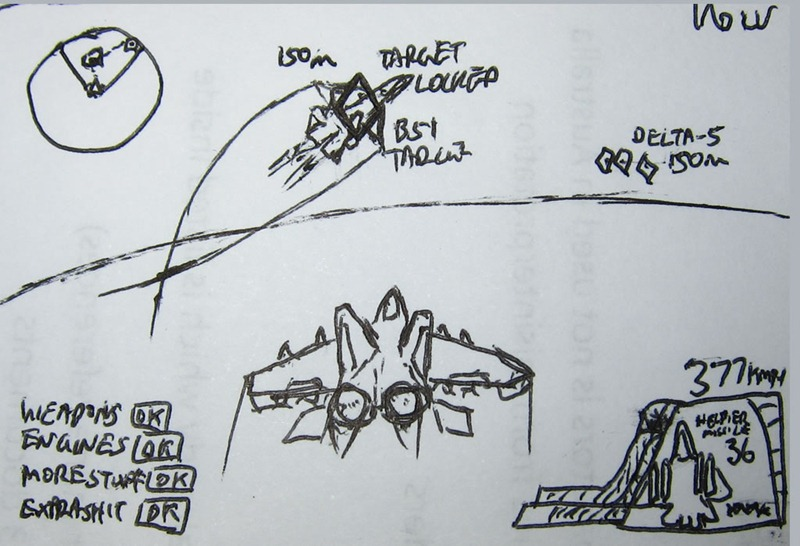

Some time back I came to a strange realisation.

While most people are become highly creative given plenty of freedom and spare time, I’ve come to observe the opposite result in myself.

During university holidays, I’m flooded with family obligations, work shifts and the need to show up once in a while to social events. In the midst I totally loose my own dear free time. It’s no secret, I ain’t a pack wolf.

Take this sketch for example. I made it *during* an audit presentation.

It’s more than I could probably think of while I was free and had nothing on my mind.

That night when I got home I realised the drawing…

****

So why do I get more out of myself during stressful times? Because doing things like this is my escape, it’s my distraction, a way to procrastinate.

We all Facebook, YouTube and some Wikipedia. But all that does is add a few bookmarks or Likes *(or [+1s](/blog/76/goodbye-facebook-hello-google/))*. Identify these dead-end escapes and out them fast!

**It’s okay to procrastinate.** I said it. Just ensure it’s productive in some direction. In a sense that it can be built up on later, and grows better the more you put into it. Whether it be soccer practice, redesigning your room, cooking something yummy or making your own game!