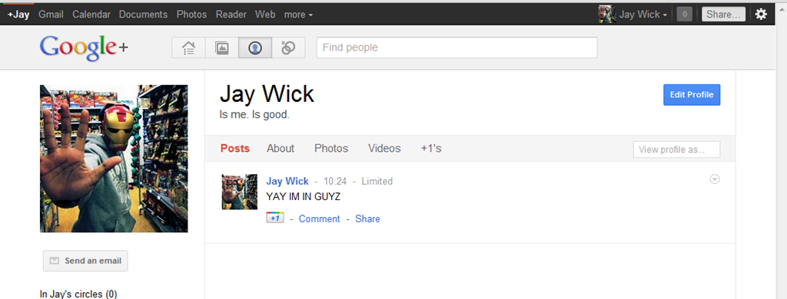

We all have had the experience of considering whether or not to add someone on Facebook. Your work colleges may not appreciate your video of you stealing street signs, your relatives might not appreciate all the photos of your passed out on the road, those cheesy guys you met five years ago in a club probably have no place checking out family photos. What ever it is, we have to accept that you can’t share everything with just one group of people, let alone to even call them all *friends*.

****

I’d love to share my photos about my [making that jet fighter game](/portfolio/blackstorm-alpha) with people online, while share family trip photos only with friends and family. I’m tired of monitoring what I post and considering who to add. I’m done with Facebook and it’s blasé attitude towards privacy. All things Google Plus deals with and that which I have high hopes for.

Add me via [+Jay](https://plus.google.com/102686218515564985686 "https://plus.google.com/102686218515564985686").

