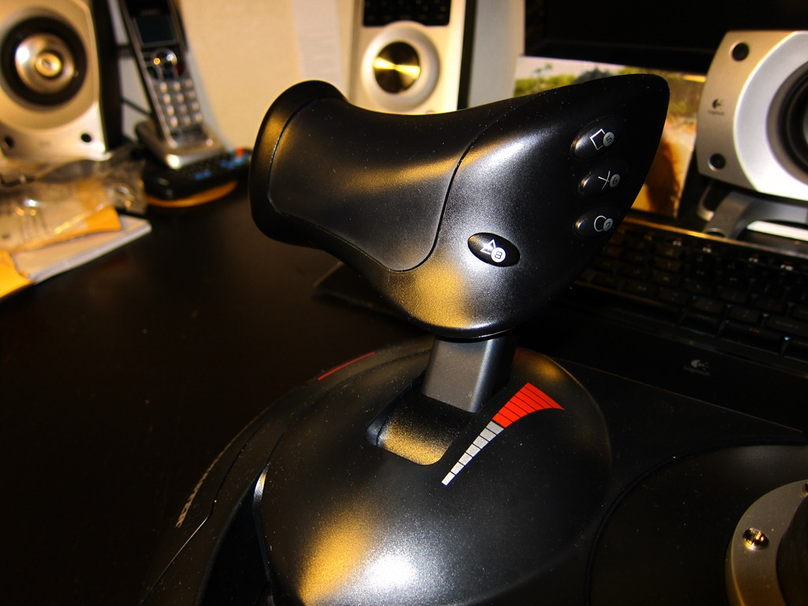
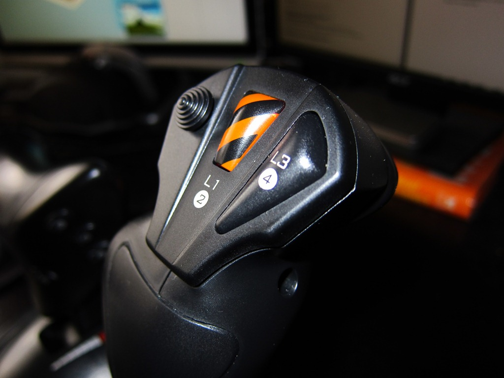
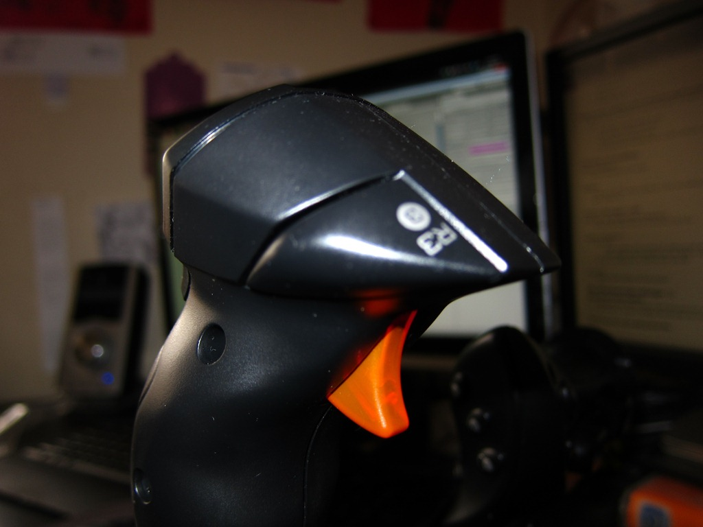
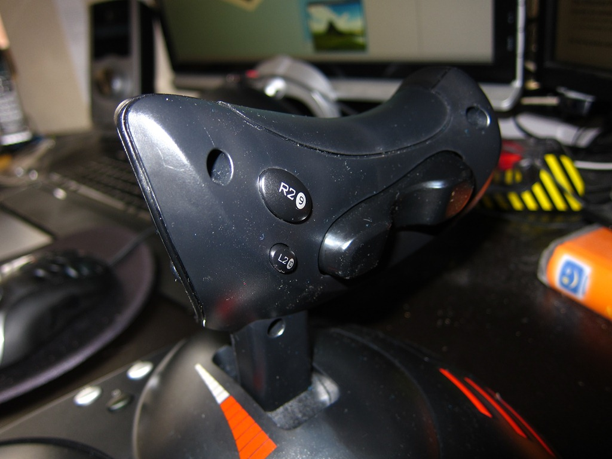

Only a few days after [investing in joystick](/blog/80/time-to-fly/) to work on my [flight combat game](/portfolio/blackstorm-alpha), I came to the stunning conclusion, “hey why not get a better one?”.

Meet the **Thrustmaster T.Flight Hotas X** in all its 5 axes, 12 buttons and and D-pad.

Now check out a video of it in action with the latest build of the game...

****

<Vimeo id='22185019' />

Surprisingly for me, I’m pretty satisfied with this whole thing where it is at the moment. So I’m going to be holding development on it for a while to concentrate on other projects.

Not to worry, you will for sure find some of the upcoming posts far more interesting than this, so be sure to watch this space!

Also, if you’re wondering what advantages there are with this joystick over the Logitech Extreme 3D PRO, they are:

*   Throttle controls actually looks real, and gameplay is a whole lot more fun 
*   Better button placement overall 
*   Extra axis (hidden behind throttle slider) 
*   Buttons on the throttle (allows separated flight and weapons controls) 
*   Sexy looking missile button 
*   PS3 compatible (not that I have one) 
*   Did I mention the throttle and flight-stick can physically separate so you can have it on either side of the keyboard? 

##In the future:

*   figuring out why I have an aircraft carrier flying around the map
*   getting some some “pew pew” filling yo speakers
*   oh and of course enemies that (instead of being cylindrical blocks floating in the sky) shoot back

But that’s for much much later. Thanks for the support everyone!

*Special thanks to fellow visionary Andrew Sario for listening to me going on and on in that lecture about all these ideas for an “epic jet fighter game”.*