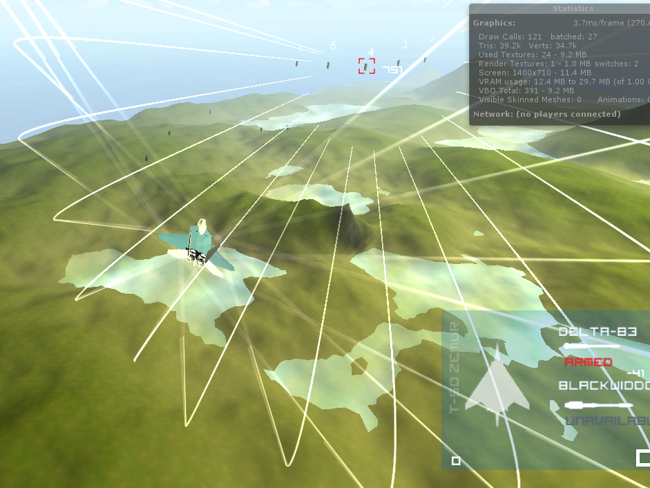
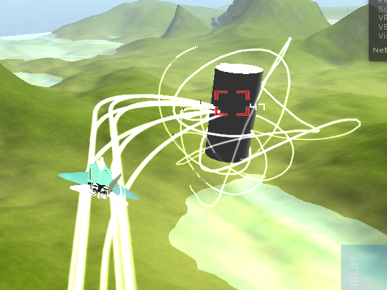
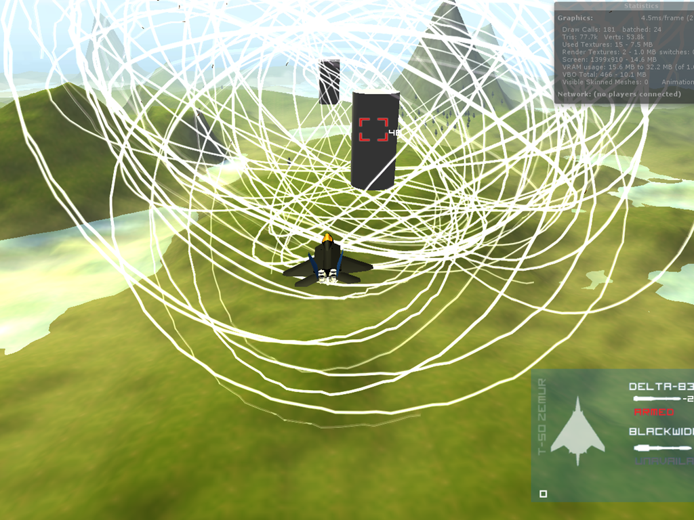
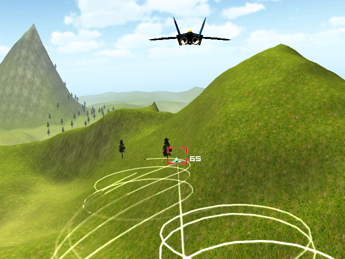

Two Mondays ago, I was bored in a lecture and pondered about making a flight combat game. Minutes later my lecture notes were filled with nothing but ideas and sketch-ups. A week later I was [flying](/blog/80/time-to-fly/).

I have to admit, I never expected to get this far so soon though.

Creating vistas as beautiful as this and walking (or flying) around it was always a childhood dream. But the environment was the easy part. Things such as flight control, intelligent enemies and missile guidance was all up to me. In fact most of my second week was purely debugging the maths.

Here’s some wins and fails for your enjoyment.

****

**Coming up next:** a new joystick, a new video.