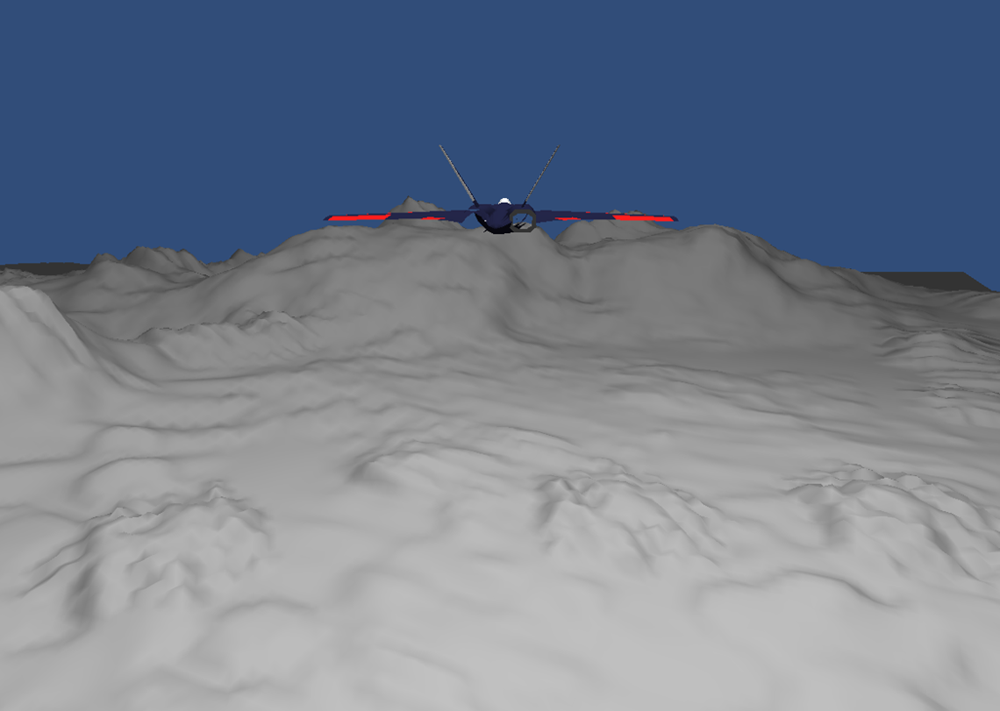
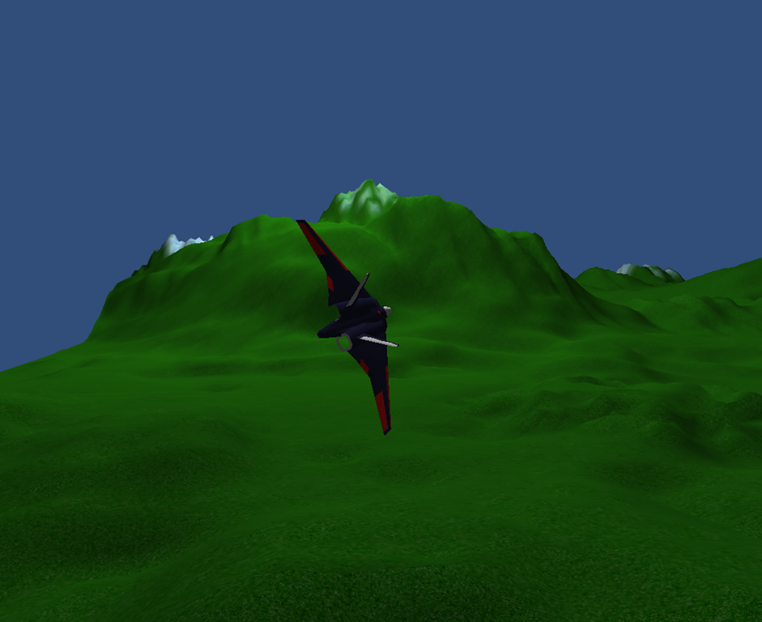

I love nothing better than a good areal dogfight. For years I longed for good titles in the flight simulator and combat genre, but everything just let me down.

So I thought to myself, it’s easy to criticise from comfort the armchair, so why don’t I just go out there and start making one instead?

**So I did.**

****

On Thursday, I went through possible gaming engines to develop on, looking for one that would allow me to rapidly develop on it as well as harnessing modern graphics technology.

I had a look at a few engines. The UDK, CryEngine, Microsoft’s XNA, WPF 3D, OpenGL, DirectX and Ogre. But it was while testing out Unity3D, that I realised I had found exactly what I needed.

In no more than an hour I had a model plane (downloaded off [Google 3D Warehouse](https://sketchup.google.com/3dwarehouse/)) flying with proper pitch and rudder rotations. The next morning, I had basic textures and banking rotations worked out.

This was fast progress given I had barely coded anything, and what maths there were was extremely basic 3D trig.

This was probably getting serious, I realised.