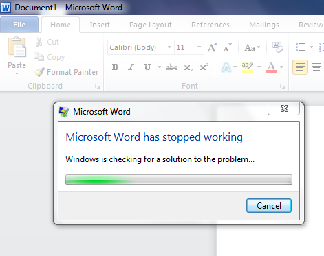
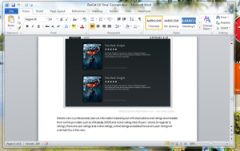

Woke up this morning with with 0 blood alcohol to discover my laptop right next to me saying the [Office 2010 beta 2](https://www.microsoft.com/office/2010/en/default.aspx "(go here to find the free beta download)") had installed successfully.

I hastily opened word, only to have it throw up in my face.

****

The problem was with an incompatible add-in called [OfficeTab](https://www.extendoffice.com/product/office-tab.html), and its uninstallation solved it. And I must say there’s some really cool [new features](https://www.beingmanan.com/wp/2009/05/office-2010-new-features/) and a far sexier look in the new Office.

The whole thing got me thinking. The simple minded user would have easily dismissed the error as inherent to the nature of Beta. Which happens more often than not. It is our narrow-mindedness that finds us blaming operating systems and computers themselves for faults caused by the complexities of the coexistence of countless components.

This is a fact of any system, that complexity gives more room for errors. So stop complaining your computer is slow and crashes. If a file’s right click context menu is crowded, or you have heaps of toolbars on your browser (I’m sorry, but there is no excuse to ever have a toolbar), or quite simply you just install everything you download – then, my friend, you have as much right to enjoy the wonders obesity if all you do is wolf down junk. The only thing that changed between when you bought your computer and now is that you kept feeding it crap.

I’ll leave you not only wondering how a beta test article got so indignant but with a Jay quote on behalf of all developers and techs…

> Please people, install responsibly.