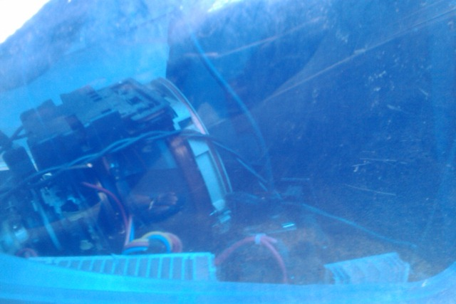

Unbeknownst to family and [insurance company](/blog/97/my-car-insurance-good-until-judgement.html), me and my mate were working on plans to build a Car PC (obviously with the help of [Google Wave](https://en.wikipedia.org/wiki/Google_Wave)!).

At about 1 am we both realised we should be studying for the end of semester exams on following week. Which was when we found this old school [iMac G3](https://en.wikipedia.org/wiki/IMac_G3) dumped outside my apartment.

****

*Yes, it could use a bit of a dusting.   
It was showered in bottle caps before.*

"Still works. Enjoy" it reads

Guts looked okay looking in

We hooked it up with a power cable, pushed the power button and ran away. Instead of exploding in our faces it went into disk repair and eventually booted into Mac OS X 9.

Unfortunately there’s no hope of installing on it Windows 7 or Android even, because its PowerPC not Intel. Newer versions of Mac would probably run too slow, its half a GHz, which is the speed of [my phone](/blog/92/the-htc-magic-in-the-hands-of-yours-truly/) for crying out loud. Maybe Solaris, Fluxbox or Fedora. But what’s Linux without compiz?

Maybe at some point we’ll put in our own hardware, or salvage the parts and turn it into an aquarium. Oh the possibilities.

Thanks neighbour!