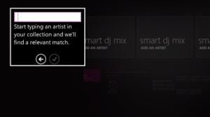

This morning I woke up to a new update of the Zune player. Of course you probably have no idea what a Zune is.

It’s Microsoft’s MP3 player. I’ve got the 8GB second generation. The reason why I chose it over any other portable media player at the time (last year) was because it:

****

*   it has radio 
*   tells you what songs are playing on radio 
*   you can flag the songs playing on radio to download later at home 
*   you can send songs to other Zunes 
*   you can communicate with other Zunes nearby
*   ability to wirelessly transfer music from your computer
*   you can sync with multiple computers and it wont mess with libraries
*   comes with the most awesome looking software
*   for me costed just $180 Australian (exchange rate was way too high back then)
*   social network of other Zune users 
*   subscription based purchases (it was something like $30 US/month = unlimited downloads) 
*   Xbox support (stream music to it) 
*   comes with an awesome looking Zune player 

They don’t sell them in Aus so I had to import mine, like I did with my [HTC Magic](/blog/92/the-htc-magic-in-the-hands-of-yours-truly/). So things like finding other Zunes or subscription stuff aren’t for me.

Anyway I thought I’d share the basics of what I ran across in the new updated player.

With the release of the [Zune HD](https://www.zune.net/en-us/products/zunehd/default.htm) came a new software update and here’s the first few things I discovered and adored straight off.

The biggest change is the Quickplay screen which puts together pinned items, new items and recently played items. If you don’t like it you can choose to have Zune start at the library like it did before.

The Now Playing screen has had some minor as well. The background slowly fades between some colours, and you can make it full screen. The background album wall has covers in different sizes.

There’s also a mini mode like in Windows Media Player 12 which is pretty nice.

Also they have thrown in Windows 7 integration with some basic controls on the Aero preview. much like with Windows Media Player 12.

****

A new thing entirely is Smart DJ which plays music based on artist. I don’t know how it works but it’s most likely similar to iPod’s Genius.

Other small changes include album art having a *Play* and *Play Smart DJ mix* command.

You have choice over which Xbox 360, you know in case you have like 10, can stream from your collection.

Some nice new backgrounds have also surfaced.

My Zune got it’s free firmware update as well. I gotta say the progress report looked pretty damn cool.

There’s also some changes to the web site I noticed.

Overall the update was smooth and looks gorgeous, [Gizmodo](https://gizmodo.com/5360126/zune-hd-review-the-pmp-evolved) calls the word cropping and anti-minimalism a little ballsy. But I love it, it is sharp and brutal and is proof that minimalism is out. It also shows the Zune team are on the right track, because anything plays media, what’s left is to enhance the user experience. Good work guys, you’ve officially made me convert from WMP12.

Check out the What’s New check at [Zune page itself](https://www.zune.net/en-us/products/learningcenter/zunesoftware/gettingstarted/newinsoftware.htm).
