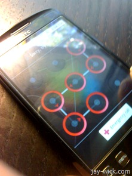

Imported right from the waters of the 'bay, it fell into my hands last night, and I've loved it dearly ever since.

Behold my latest gadget, the [HTC Magic](https://www.gsmarena.com/htc_magic-2714.php).

For those of you living in [a remote village](https://www.theonion.com/content/video/google_opt_out_feature_lets_users), Google entered the world of mobile phones making a new mobile operating system called [Android](https://en.wikipedia.org/wiki/Android_%28operating_system%29). Sounds good, Microsoft did it, Apple’s in on it too, but so what?

_Well, it’s open source._

Meaning any mobile phone manufacturer (you know Samsung, HTC, Motorola, Nokia and them) could hook it up on their hardware at no cost at all, liberating hardware restrictions, unifying the user experience and more importantly reducing overall cost for the consumer.

And I just got mine.

Let me start by saying it was far better than I expected, the capacitive touch screen was more responsive than I first thought and getting used to typing on it wasn’t that difficult. The interface was simple and clean, it was more polished than the android emulator lead me to believe.

The browser was nice, and included Flash. I wouldn’t have minded the multi-touch like that of its brother the [Hero](https://www.htc.com/www/product/hero/a-closer-look.html), but more on that later.

The screen’s 3.2 inches and sports a resolution of 320 x 480. And one thing that had me worried was the visibility of text while browsing the web. But as you can see, the Magic did not cease to impress.

There’s a 3.15 megapixel camera and the above image is a sample shot. Not the world’s greatest camera, but at least I got to show off my desktop. Unfortunately, unless you’re a tripod, or a possibly a scarecrow, the autofocus won’t make your shots blur free. Video quality is a dodgy QVGA at 15 fps, which probably wont get you nominated in the Cannes film festival but would be enough to capture [fun things](https://failblog.org/2009/01/28/ironing-fail/) happening to [your friends](https://failblog.org/2009/06/16/fire-safety-fail/).

To be honest one of the reasons I wanted a smartphone was because of threaded SMS, which presents messaging for what it is – a conversation.

All good things aside (like the cool ways to use your phone including unlocking the screen by entering a touch pattern), there are things I need to address.

A lot of default apps from the phone’s Android installation are missing. Including Android’s application store, Marketplace.

The only way to get them is to throw in a custom ROM (essentially the OS of the phone). Which involves a good dose of hacking and [reading](https://forum.xda-developers.com/).

Although, despite not having the Marketplace, you could still install them straight from an SD card or just download them from the internet via the phone’s browser.

In the end, it was a fight between the HTC Magic, HTC Hero or the Samsung Galaxy. The Magic and Hero are almost identical in specs, so the main advantage of the Hero was just the Sense interface. However in a few days time (when I don’t have assignments due), I plan to [flash the HTC Hero ROM](https://www.youtube.com/watch?v=8TKOF-zBU2I) onto the Magic for some [Sense UI goodness](https://www.youtube.com/watch?v=GCodXvFrz5E). Stay tuned for that!

And now I leave you with some random images:

 

Extra notes: the HTC Magic I have is not rebranded. There are Vodafone and T-Mobile versions which for some reason have less RAM. Note that is an issue if you’re planning on installing a Hero ROM.
