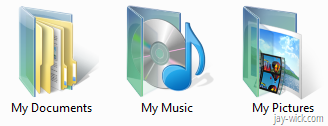
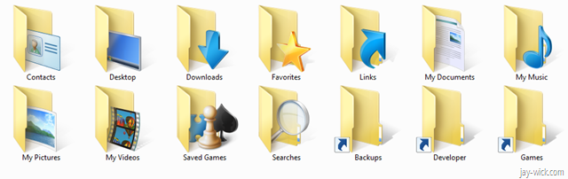
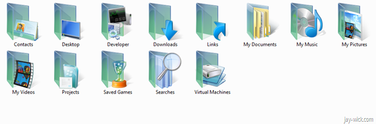

**Yep I did it.**

I have 3 machines at home and now all of them are running Windows 7 RC as their main OS. Amidst the [awesomeness](https://www.softsailor.com/news/887-70-useful-windows-7-tips-tricks.html) that is [Windows 7](https://www.engadget.com/2009/08/12/windows-7-review/), I started feeling a little nostalgia for my old Vista icons long gone from user folder.

Windows 7's user folder icons now look just like ordinary folders but with extra icons symbolising their designated purpose. This is down a notch from Vista’s which went that extra step to emphasise their deviation from ordinary folders by swapping the cheap manila folder for glass.

****

In Windows 7. They got rid of it.

If you don’t have much going on in your life and have nothing better to do, and are in desperate need of that glassy texture back where it belongs, then read on. Otherwise read [this](/blog).

# For your saftey

*   Difficulty – 3/10 (involves manual labour and also a download, and patience, no great knowledge is required however)    
*   Time wasted –3 minute (unless you haven't learned how to aim with your mouse yet)   
*   Result – **works just fine!** (No registry or resource hacking involved so updates wont screw them up)  

# Firstly,

Download the icons off the interwebs that match your needs. Remember you need `.ico` files. I found a very good set here: [https://kmilo17pet.deviantart.com/art/Vista-RTM-Folders-104-icons-75788424](https://kmilo17pet.deviantart.com/art/Vista-RTM-Folders-104-icons-75788424)

Extract the ICOs to a folder you will most definitely never move (for me that’s Drive:\Jay\Pictures\Icons)

# Step 2.

Find the User folder starting from the hard drive (because accessing it from the desktop or start menu doesn’t let you customise icons).

# Step 3.

Go the the properties of each folder (use the <kbd>Alt</kbd> + <kbd>Enter</kbd> shortcut) and then get to the Customize tab. Press Change Icon and choose an icon. Do this for ever folder which allows you to customize the icon, the next step will explain what to do with the rest.

# Step 4.

Simply open the folders that won't let you customise the icon.

In the address bar (you may use the <kbd>F6</kbd> + <kbd>Enter</kbd> shortcut), add "desktop.ini" to access a hidden system file

Change the value of "IconResource" to the location of your icon. (use <kbd>Shift</kbd> + <kbd>Right Click</kbd> on icon file and then *Copy As Path*). Note: ensure you don't add any quote marks. Save the file and close it. Do this for the rest of your files.

# Step 5.

This is if you’re really picky.

Get to the start menu (just press the Window key will you?). Type in something like "show desktop icons" to reveal a Control Panel option to *Show or hide common icons on the desktop*. Go to it.

Click on your User folder and click on *Change Icon*. Find your icon. And voila!

Oh and a final step! Go do something fruitful today, please?

**Update:** You can get rid of the *"MY"* in My Documents and My Pictures etc simply by renaming it. It hasn't broken anything for me (yet).
