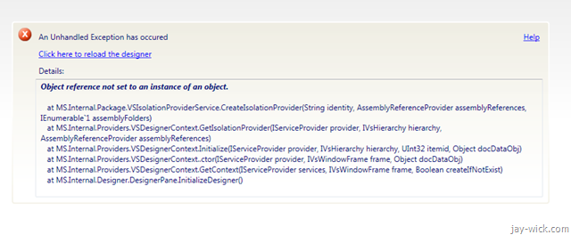
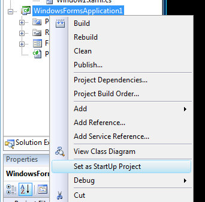

It's one of those nights. The loved ones are fast asleep. You slowly un-entangle yourself from your wife's loving arms and creep out of bed. It's 4 am as you fire up the laptop, inspiration burning in your heart. Stretching the digits, preparing for the early morning coding to come you wait for Visual Studio 2008 to start. But wait... what's this?

****


The debug button is disabled! You feel that ominous feeling go up the spine.  
 You open the XAML designer, fearing the worst. And it hits you in the face...



```
An Unhandled Exception has occurred. Click here to reload the designer Details: Object reference not set to an instance of an object.
  at MS.Internal.Package.VSIsolationProviderService.CreateIsolationProvider(String identity, AssemblyReferenceProvider assemblyReferences, IEnumerable`1 assemblyFolders)
  at MS.Internal.Providers.VSDesignerContext.GetIsolationProvider(IServiceProvider provider, IVsHierarchy hierarchy, AssemblyReferenceProvider assemblyReferences
  at MS.Internal.Providers.VSDesignerContext.Initialize(IServiceProvider provider, IVsHierarchy hierarchy, UInt32 itemid, Object docDataObj)
  at MS.Internal.Providers.VSDesignerContext..ctor(IServiceProvider provider, IVsWindowFrame frame, Object docDataObj)
  at MS.Internal.Providers.VSDesignerContext.GetContext(IServiceProvider services, IVsWindowFrame frame, Boolean createIfNotExist)
  at MS.Internal.Designer.DesignerPane.InitializeDesigner()
```

The visual designer (place where you drag and drop controls to the Form) is broken! If this has happened to you, the following may be true:

*   Using Expression Blend and Visual Studio 2008 together to write some awesome WPF app for UI goodness 
*   Recently installed a Visual Studio 2008 Service Pack 
*   The subject of the jealous wrath of a neglected Windows Form deity Don't get me wrong Windows Forms is good. But I want my WPF projects back!

At the date of publishing this post, there is no known solution. I read all the forums and blogs, ran all the patches and hotfixes but nothing seemed to help. However there was chatter on a workaround involving something to do with adding new projects. I'm not sure who originally came up with this but, **we thank you!**  
 Here's the gist of what to do to be able to debug your WPF projects on Visual Studio 2008 again.

# Step 1.

Add a new project by going to *File > Add > New Project*. Choose a new Windows Form project and press OK.


# Step 2.

Once you have the new project added to your Project Explorer pane, just right click it and click on *Set as StartUp Project*.



# Step 3.

Much to your delight, you should see the god forsaken Debug icon enabled again. Press it and the new project will run.


# Step 4.

This will cause your designer to pick itself up and work again, for how long I know not. Now change your original project to the StartUp project as you did with the dummy new project in Step 2.

This has worked for me every time the designer decides to fail. By saying *worked*, I'm saying I can debug and compile for a while. The issue lies with the designer crashing internally (The invisible-to-developer class affected is called `MS.Internal`). Also to note, I have not run into this problem when using VB.NET and WPF. Perhaps it's a C# only issue? Well whatever it is, I'm sure they will come up with something, hopefully soon.

Happy coding. And remember to thank the internet for makeshift solutions like this.
