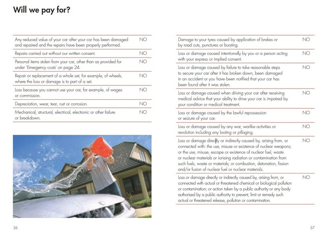

Less than a year ago I got my first car. And in the first six months I drove over 7000 kilometres, none of which I can actually recall. Going off topic from [calculators](/98/the-calculator-alternative-is-here/) and [organisation](/blog/100/bubbles-concept/) dilemmas, let's look at car insurance. Specifically, mine.

****

Even before I could drive I was planning a CarPC, much like what [this guy did](https://www.mp3car.com/vbulletin/1292823-post35.html). Imagine that, some WPF app with voice recognition and touch, easily under 800 Australian. But we could safely agree the electrical rewiring would be some insurance nightmare. So that plan's off for a while, which I don't mind because I have discovered my budget Aldi GPS, along with SD card support, somehow also supports divx and mp4s. I plan to hack it sometime in the holidays and add my own voices, **"I said turn left dumbass!"**

I'm under comprehensive insurance, which to me meant it would cover stupid accidents that could only logically be my fault. You know, like scraping the crap out the rear of the car against a pylon in the shared garage like I did a few months back, which I fixed with my own money I might add.

Anyway, I was reading through the pamphlet to understand what was or wasn't covered. Like for example this is obviously not covered,

> Loss or damage caused when driving your car after receiving medical advice that your ability to drive your car is impaired by your condition or medical treatment.

There are the logical few you mightn't argue with, but then things become slightly tense,

> Loss or damage caused by the lawful repossession or seizure of your car.

That kinda sucks really. Understandable though. But I wonder what happens if Jack Bauer commandeers your vehicle in pursuit of terrorists. I read on, and things became even more serious. Remember, I'm reading the list of what is **not** covered,

> Loss or damage caused by any war, warlike activities or revolution including any looting or pillaging.

So avoid the crossfire, tanks, carpet bombing and the occasional Iraqi looters, right? Sorry to say, but there were more things they would refuse to cover. The following is taken word for word by the way,

> Loss or damage directly or indirectly caused by, arising from, or connected with: the use, misuse or existence of nuclear weapons; or the use, misuse, escape or existence of nuclear fuel, waste or nuclear materials or ionising radiation or contamination from such fuels, waste or materials; or combustion, detonation, fission and/or fusion of nuclear fuel or nuclear materials.

It was getting quite obvious the guys who wrote this had just come back from a 24 marathon. Their next statement even tied in with the current season.

> Loss or damage directly or indirectly caused by, arising from, or connected with actual or threatened chemical or biological pollution or contamination; or action taken by a public authority or any body authorised by a public authority to prevent, limit or remedy such actual or threatened release, pollution or contamination.

Does AAMI know something we don't? We may never know until it's too late. But what I can say is that the next time someone complains about car damage, show them this and remind them: things could be a **whole** lot worse.

I still think they missed something, so here's *my addition*,

> Loss or damage directly, indirectly, expressly or implicitly caused by, arising from, or connected with the invasion, confrontation, annihilation, affiliation, or the revelation either planned or unplanned of an extraterrestrial civilisation; or contact with alien transport or technologies such as UFOs, time machines, or teleportation, not limited to the side effects of said invasion including Godzilla, Keanu Reeves, or Arnold Schwarzenegger.

***Lucky you're with AAMI...*** Here's the page from the actual pamphlet for the disbelievers. The full PDF is available at [https://www.aami.com.au/policy-documents/pdf/comprehensive-car-insurance-policy-act-nsw.pdf](https://www.aami.com.au/policy-documents/pdf/comprehensive-car-insurance-policy-act-nsw.pdf).

Little does stock photo man blissfully washing his car know of the impending doom upon the world as prophesied by his insurance company.

Happy driving, to you all!
