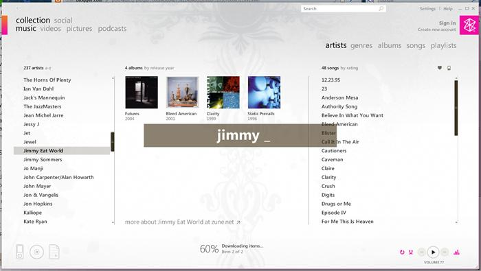

After a few half-hours of cleaning up the code, and the rest of the time lounging and forgetting it existed, **it's finally here.** In my [last post](/blog/99/calculator-alternatives) I passionately complained about the interface of calculator software. I promised you all I'd put to rest our frustrations by actually coding my vision, intent on no longer endorsing backwardness in design and to liberate the user from half-blindness of bundled calculator software. Okay maybe I didn't really say that, but it was heavily implied. *I think.*

But the point is, **it's finally here**.

****

# How it works

There's no mouse required. Just enter your equation like

```
1+(6+5)/7-7^0.2
```

The equation is calculated immediately and since it is a mere textbox, you can move your cursor around, copy and paste in or out of it, and it will keep calculating on every change you make. Press enter to copy the answer to your clipboard. Press escape to simply get out. Go back to your programs, the equation will float on top.

# Design Inspiration

From the Zune software's quick search. And after a lot of time figuring out what to call it, wanting something simple yet memorable, I decided on calling it Kalq. Which is actually stands for *"Kalq Always Looks Quick"*. Okay fine it's not, I made that up just now.



# The Code

**Warning!** The following section may contain information useful for developers, fixed-width fonts, hacker jargon, [TLAs](https://en.wikipedia.org/wiki/Three-letter_abbreviation), or even lame programming jokes.

Okay now that we've gotten rid of them non-developer types, let's get into details. Too bad the entire engine is only one line of code.

    Answer = ScriptControl.Eval(Equation)

Microsoft Script Control was a VB6 control which simply runs JS and VBScript, making this calculator a mini interpreter. The `Eval()` function evaluates an expression, making it ideal for calculations. If you just realised what that means, a pat on the back for you. Extensibility FTW!

With such power however, there are it's drawbacks. Since the EVAL function translates pure VB or Java code, you have the power to do stuff like delete files or start programs, and all kinds of other things open to abuse. If you see my source code you'll notice the `IsSafe` function which runs the contents of the expression being evaluated against a whitelist of functions which *are *allowed, limiting the program to merely numeric calculations, which is what we wanted anyway.

Although this `ScriptControl` function works fine, it was an easy alternative to writing code that actually calculates something. But I'll look into that later sometime. For now I have what I need.

Back to shoulder rubbing the mere mortals that are non-developers.

# The future

As I was telling my developer friends in the last section, there is an interesting future for this program. This is from the fact you can add your own functions. Currently there are basic trigonometric and boolean functions like SIN or XOR, but in the near future you will be able to write your own functions.

Not just that, but I am looking to make more of this program customisable. This involves exposing key elements of its interface and code, allowing you to tweak default behaviour of functions or equations and personalise the colours, size, and even screen position without having to meddle with the code.

I'm looking at implementing a history and memory function. Which would be an obvious plus.

# Good for you, now where's the download?

Well head over to the [home page](github.com/jaywick/kalq) for Kalq and knock yourself out.

I hope you enjoy this little application and may you find good use for it.