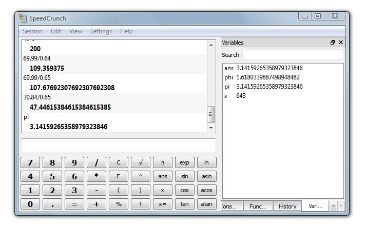
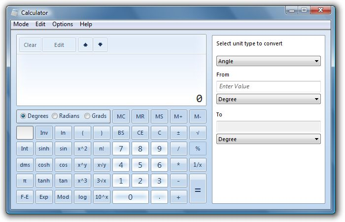
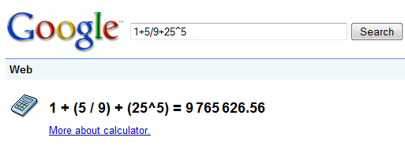

Let's face it. Calculators are awesome. Not only do they let us forget how multiplication works, comfort us in the prospect of basic addition, bestow in us the arrogance to scoff at even the idea of a printed log table, but they also ensure that the future of our civilisation will use less and less of their brain devoting more time doing more important things like yawning and watching ants. You know. One of the few things computers *can't* do for us. Yet.

Once anything enters the digital realm. That is, if it's on this side, you know - behind the screen you're staring at right now, then it enters a new universe where the laws of physics do not apply, and are replaced by some other rules that we are yet to fully understand. Which is why it annoys me that calculators in modern day operating systems are designed like what is pictured here.

Simulating a real-life calculator on a computer? That's just brilliant.

****

I used to have one of those ancient Casio scientific calculators. The best part about them was that you couldn't go back any steps. If you typed "55+2974-0.81". And realised you were meant to enter 2589 not 2974, then you'd have clear it and type again (or if you're clever, just punch in an extra "- 385", in which case one would wonder why you would have needed a calculator in the first place). Using a calculator meant you would be half blind. The equation was meant to be in your head.

A few years later I remember getting the new ones with a line display. They showed what you were actually evaluating, which was brilliant. So a few months ago I went looking around for something similar on the desktop and ran across this stuff.

# [SpeedCrunch](https://speedcrunch.org/en_US/index.html)

# [Windows 7's Calculator](https://lifehacker.com/5082048/get-the-windows-7-calculator-in-vista)

Despite their power, as a programmer who needs a quick calculation once in a while I decided to make my own one. Something without the hideous buttons, something you could simply type onto the screen. Much like what I discovered on the Mac OS X's spotlight search box. You could type in quick calculations and it would show you the answer. Or like Google's own calculator.

Stay tuned for my next post where I will discuss the finished program, tease you with some screenshots, give exhilarating explanations of its key driving code, then finally surrender the download links to both source and application.
