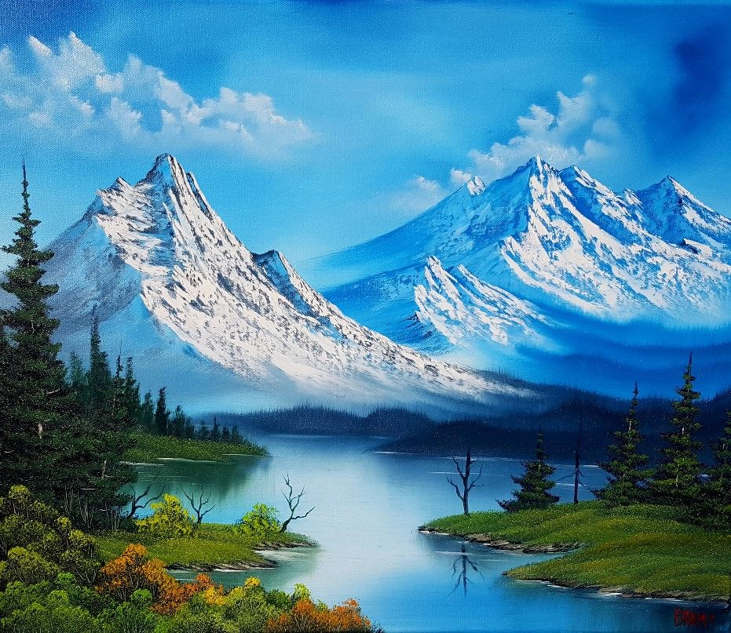

We touch the canvas, the canvas takes what it wants. Don't kill all your dark areas - you need them to show the light. See there how easy that is. Each highlight must have it's own private shadow.

---



And maybe, `maybe`, maybe... You have to make almighty decisions when you're the creator. Let's make some happy little clouds in our world. Let's get wild today.

```ts
const myGreeter = new Greeter('hello, world')
myGreeter.greeting = 'howdy'
myGreeter.showGreeting()

class SpecialGreeter extends Greeter {
    constructor() {
        super(
            `Isn't that fantastic? Isn't that fantastic? You can just push a little tree out of your brush like that. I sincerely wish for you every possible joy life could bring. That's what painting is all about. It should make you feel good when you paint.`
        )
    }
}
```

> Working it up and down, _back and forth_. Talk to trees, **look at the birds**. Whatever it takes. This is probably the greatest thing to happen in my life - to be able to share this with you.
> <cite>– Bob Ross</cite>


Do an almighty painting with us. Now we don't want him to get lonely, so we'll give him a little friend. Don't fiddle with it all day. No pressure. Just relax and watch it happen. <kbd>CMD</kbd><kbd>Q</kbd> makes us happy. <sup>If</sup> <sub>it</sub> makes you happy then it's good. ==Isn't it fantastic that you can change your mind and create all these happy things?==

Let's just [example](http://example.com) it!

And just raise cain. Let's put some happy little clouds in our world. I'm gonna add just a tiny little amount of Prussian Blue.

<http://foo.bar.baz>

Isn't that fantastic? Isn't that fantastic? You can just push a little tree out of your brush like that. I sincerely wish for you every possible joy life could bring. That's what painting is all about. It should make you feel good when you paint.

Wait there's more

1. Yes
1. There
1. Really is

And a table later on

-   bullet
-   lists
-   too

# H1

## H2

### H3

#### H4

##### H5

###### H6

Here's that table I promised

| Key | Value |     |
| --- | ----- | --- |
| foo | bar   | 🌏  |
